# DeepSeek Harness 系统设计文档（as-is 现状还原）

> 本文档基于 deepseek-harness 仓库现状（`packages/`、`apps/`、`docs/`）还原其系统设计，供不了解该项目的读者建立整体认知。信息来源：`docs/architecture.md`、`docs/subsystems/*.md`、各包 README 与源码。

## 范围与假设

本文档按"跳过烤问"模式从代码与文档推导，编写者自行敲定的取舍集中标注于此：

1. **详设范围**：仓库有 40+ 包组，逐一展开不现实。第 3 章只详设产品脊柱（会话日志、Agent 与循环、工具管线、LLM 接缝）、会话数据面、组合层与通道层；其余能力接缝（shell / fs / lsp / subagent 等约 20 个家族）按统一的"能力接缝三角色"模式归纳为一节（3.6），不再逐族画图。
2. **"对外接口"的解释**（影响 2.2 节）：harness 不是"服务 + DB"式业务系统，其对外契约有四类——人机/程序化**通道协议**（Web RPC、ACP、SDK JSON-RPC）、**CLI 命令行**、**声明式组合配置**（cordis.yml / profile / bundle）、**插件扩展 API**（`ctx.*`）。后两类是 harness 区别于普通服务的主要"接口"，故一并列入 2.2。
3. **痛点还原**（1.1 节）：仓库文档从"怎么做"写起，未直陈立项动机；1.1 的三个痛点是编写者从产品形态与架构决策反推的，属于推断而非引用。
4. 全文术语保留英文原文（如 SessionEvent、capability seam），首次出现给中文释义；文档语言为中文。

---

## 全局绘图规范

- 统一使用 mermaid 绘图，图源内嵌在 Markdown 中；
- **7±2 原则**：每张图的节点 / 参与者 / 泳道控制在 5~9 个以内；超限时先用 subgraph 分组归并，仍超限则拆"主图 + 子图"；
- 公共依赖线优先从实际负责的具体模块引出（如会话持久化线从会话数据面引出）；确实由全系统共同承担的依赖才从 subgraph 整框引归并线，并在图下配图例；
- 跨图一致性：同一模块的类图、时序图、状态机图中的类 / 角色命名与职责一致；下层图不引入上层图未声明的顶层角色；
- 类图按 Sketch 模式使用 UML：成员用"名称 + 一句语义"速写体，方法行必须含 `()`，职责注释行不含半角括号；
- 图的目的是让人看懂结构，不穷举实现细节。

---

# 1 需求背景与目标

## 1.1 背景与问题

大模型编码助手（coding agent）类产品在内核上普遍存在三个结构性问题：

- **模型、工具、执行环境与产品内核硬耦合**：换一个模型供应商、把 Bash 从本机挪到远程沙箱、或者换掉 UI，都要改内核代码甚至整体分叉。组件无法独立演进，产品差异化被迫以 fork 为代价；
- **会话上下文脆弱且不可重建**：长任务动辄几十轮模型调用与工具执行，进程崩溃、重启、换模型后，"模型看到的历史"与"落盘的数据"常常各自为政，无法从持久化数据精确重建一次模型请求，replay、fork、审计、遥测各做各的一份投影；
- **人机协作面与自动化接入各自实现**：交互式 UI、无人值守的一次性执行、编辑器集成（ACP）、程序化 SDK 各自维护一套会话驱动逻辑，行为不一致、缺陷重复出现。

问题根源在于 agent 运行时的处理对象：模型会话本质是**一条不断追加的事件流**（用户输入、流式响应、工具调用与结果），而传统架构把它存成"消息表 + 散落的状态字段"，丢失了时序与来源信息；同时 agent 的每个能力（执行命令、读写文件、子代理）天然有多个可替换实现，需要一等公民的可替换接缝，而不是 if-else 分支。

## 1.2 方案目标：范围内 / 范围外

**范围内（本系统做）**

- **插件化 agent 运行时**：一切皆插件（包括模型适配器、工具注册表、会话日志、agent 循环本身），从配置即可替换任何部分；
- **事件溯源的会话模型**：append-only 的 `SessionEvent` 日志是唯一事实源，模型历史由日志派生，保证"模型可见 ⟺ 已落盘"；
- **能力接缝机制**：每个可替换能力按 Service Definition / Provider / Consumer 三角色设计，一次 provider 替换即改变整个产品行为（如执行环境从本机切到 E2B 沙箱，Bash / PTY / LSP 随之迁移）；
- **多形态入口**：浏览器 Web UI、CLI、一次性 headless 执行、ACP 自动化协议、进程外 SDK（TypeScript / Python），共享同一 agent 脊柱；
- **声明式组合**：profile / bundle / preset 三层 cordis.yml 补丁叠加，用户可替换任意一行插件配置；
- **会话持久化与派生物**：JSONL / SQLite 后端、崩溃恢复、投影（标题 / 统计 / 搜索）、遥测。

**范围外（本系统不做）**

- **模型本身**——由 LLM 提供商（DeepSeek 等）提供，harness 只做适配；
- **模型供应商密钥的发行与计费**——用户自行配置凭证（env / `.env` / settings）；
- **业务侧任务编排**（如 CI 流水线、代码托管集成）——由调用方或上层产品负责，harness 提供 ACP / SDK 供其驱动；
- **沙箱技术的安全保证本身**——bwrap / Landlock / Seatbelt / E2B 是外部设施，harness 只提供接缝与封装；
- **MCP / LSP 服务器的实现**——harness 作为客户端连接它们，不实现服务端。

**关键边界**：harness 是"运行模型的壳"，不是"模型的替代品"——它拥有会话、工具、组合与持久化的全部契约，但每次模型请求的字节流最终由外部 provider 产生。

---

# 2 系统总体设计

## 2.1 系统上下文与架构总览

一次运行的 `dsh` 是一棵在启动时由有序配置层组合出来的**插件树**（Cordis 框架：插件向共享 Context 贡献服务、类型化事件与可逆 effect）。系统内按职责分为六层：通道层把浏览器 / 自动化客户端的请求翻译成对 agent 的驱动；组合层决定这棵树的形状；Agent 核心脊柱是会话循环的最小内核；能力接缝家族提供全部可替换能力；会话数据面负责持久化与派生；人机协作面处理审批与命令。

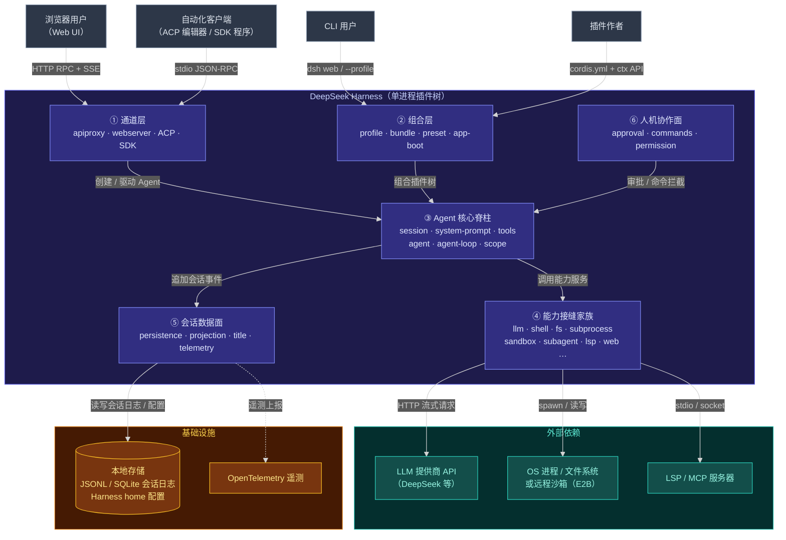
```mermaid
%%{init: {'theme':'dark', 'themeVariables': {'fontSize':'14px'}}}%%
flowchart TB
%% ===== 左侧：上游调用方与用户角色 =====
Browser["浏览器用户<br/>（Web UI）"]
CliUser["CLI 用户"]
AutoClient["自动化客户端<br/>（ACP 编辑器 / SDK 程序）"]
PluginAuthor["插件作者"]

%% ===== 中间：dsh 系统边界 =====
subgraph DSH["DeepSeek Harness（单进程插件树）"]
    direction TB
    Channel["① 通道层<br/>apiproxy · webserver · ACP · SDK"]
    Compose["② 组合层<br/>profile · bundle · preset · app-boot"]
    Spine["③ Agent 核心脊柱<br/>session · system-prompt · tools<br/>agent · agent-loop · scope"]
    Seams["④ 能力接缝家族<br/>llm · shell · fs · subprocess<br/>sandbox · subagent · lsp · web …"]
    DataPlane["⑤ 会话数据面<br/>persistence · projection · title · telemetry"]
    Human["⑥ 人机协作面<br/>approval · commands · permission"]
end

%% ===== 右侧：下游依赖 =====
subgraph External["外部依赖"]
    direction TB
    LlmApi["LLM 提供商 API<br/>（DeepSeek 等）"]
    OSProc["OS 进程 / 文件系统<br/>或远程沙箱（E2B）"]
    LSPServer["LSP / MCP 服务器"]
end

%% ===== 底部：基础设施 =====
subgraph Infra["基础设施"]
    direction LR
    LocalStore[("本地存储<br/>JSONL / SQLite 会话日志<br/>Harness home 配置")]
    OTel["OpenTelemetry 遥测"]
end

%% ===== 调用关系 =====
Browser -->|"HTTP RPC + SSE"| Channel
CliUser -->|"dsh web / --profile"| Compose
AutoClient -->|"stdio JSON-RPC"| Channel
PluginAuthor -->|"cordis.yml + ctx API"| Compose
Channel -->|"创建 / 驱动 Agent"| Spine
Compose -->|"组合插件树"| Spine
Spine -->|"调用能力服务"| Seams
Spine -->|"追加会话事件"| DataPlane
Human -->|"审批 / 命令拦截"| Spine
Seams -->|"HTTP 流式请求"| LlmApi
Seams -->|"spawn / 读写"| OSProc
Seams -->|"stdio / socket"| LSPServer
DataPlane -->|"读写会话日志 / 配置"| LocalStore
DataPlane -.->|"遥测上报"| OTel

classDef external fill:#2d3748,stroke:#94a3b8,color:#e2e8f0
classDef dsh fill:#312e81,stroke:#818cf8,color:#e0e7ff
classDef downstream fill:#134e4a,stroke:#2dd4bf,color:#99f6e4
classDef infra fill:#78350f,stroke:#fbbf24,color:#fde68a
classDef cDsh fill:#1e1b4b,stroke:#6366f1,color:#c7d2fe
classDef cDownstream fill:#042f2e,stroke:#14b8a6,color:#5eead4
classDef cInfra fill:#451a03,stroke:#d97706,color:#fcd34d

class Browser,CliUser,AutoClient,PluginAuthor external
class Channel,Compose,Spine,Seams,DataPlane,Human dsh
class LlmApi,OSProc,LSPServer downstream
class LocalStore,OTel infra
class DSH cDsh
class External cDownstream
class Infra cInfra
```

| 服务/模块 | 定位 | 核心职责 |
|---|---|---|
| **① 通道层** | 对外接入面，多形态 | Web RPC 网关与 HTTP 服务器、浏览器 Client、ACP 自动化服务器、SDK JSON-RPC 服务器/客户端；把外部请求翻译为对 `ctx.agents` 的驱动 |
| **② 组合层** | 启动与组装 | profile / bundle / preset 三层 cordis.yml 补丁叠加；启动引导（`.env`、Loader 防护）；决定插件树形状 |
| **③ Agent 核心脊柱** | 最小内核，产品 API | append-only 会话日志（`ctx.sessions`）、提示词装配（`ctx.systemPrompt`）、工具注册表（`ctx.tools`）、Agent 契约与注册表（`ctx.agents`）、默认驱动循环（`ctx.agentLoop`） |
| **④ 能力接缝家族** | 可替换能力集 | 每个能力按 Service Definition / Provider / Consumer 三角色组成：llm、shell、fs、subprocess、terminal、sandbox、lsp、skill、web、subagent、compaction、jobs、workflow 等约 20 族 |
| **⑤ 会话数据面** | 持久化与派生 | 会话持久化接缝与 JSONL / SQLite 后端、崩溃恢复、投影（标题 / 统计 / 搜索）、遥测上报 |
| **⑥ 人机协作面** | 人在环中 | 工具审批、权限预设、斜杠命令、ask-user 提问；审批结果回注工具执行管线 |

## 2.2 对外提供的接口

系统有四类对外契约。横切约定：浏览器通道的写方法与配置面方法受**回环同源栅栏**限制（仅 loopback + same-origin 请求可执行）；ACP / SDK 走本地 stdio 进程管道，无认证；所有 RPC 的业务错误放在响应体的 error 分支，HTTP 状态码只表达载体层。

**接口清单**

| # | 接口 | 载体 | 用途 |
|---|---|---|---|
| 1 | CLI `dsh` | 命令行 | 启动 Web UI（`dsh web`）、按 profile 组合运行（`dsh --profile <name>`）、一次性任务（`--profile headless`）、插件管理（`dsh plugin --profile <name> add`）、导出实际配置（`--dump-config`） |
| 2 | Web RPC | HTTP POST `/api/<method>` + SSE 下行流 + POST `/api/respond` | 浏览器客户端的全部会话 / 工作区 / 设置操作与服务端推送 |
| 3 | 会话日志导出 | HTTP GET `/api/session.export` | 流式下载会话日志 ZIP（含子代理与图片附件） |
| 4 | ACP 协议 | stdio JSON-RPC | 编辑器 / 自动化客户端创建 agent、发 prompt、收回复、按策略应答权限请求 |
| 5 | SDK JSON-RPC | stdio JSON-RPC（NDJSON 行帧） | 进程外程序驱动 harness 运行时，订阅全量会话事件流 |
| 6 | 组合配置 | cordis.yml / `cordis.patch.yml` | 声明式插件树组合：profile 叠加 bundle，补丁按 id 替换整行配置 |
| 7 | 插件扩展 API | 进程内 `ctx.*` | 插件注册服务、监听类型化事件、挂载可逆 effect |

### 接口② Web RPC

四象限报文模型（发起方 × 请求/响应），与物理载体解耦。统一约定：每个响应原样回显对应请求的 `rpcId`，从不新造；`result` 为 `RpcResult` 判别联合（`{ ok: true, value }` / `{ ok: false, error }`）。

**ClientRequest**（POST `/api/<method>` 请求体）

| 字段 | 类型 | 必填 | 默认值 | 说明 |
|---|---|---|---|---|
| type | enum | 是 | —— | 固定 `client-request` |
| rpcId | string | 是 | —— | 关联 id，发起方铸造（实现用 UUID） |
| method | string | 是 | —— | 方法名，如 `session.prompt` |
| payload | object | 是 | —— | 业务参数，结构由各方法的域接口签名定义 |

**ServerResponse**（该 POST 的响应体）

| 字段 | 类型 | 说明 |
|---|---|---|
| type | enum | 固定 `server-response` |
| rpcId | string | 回显请求的 rpcId |
| result | object | `RpcResult`：成功 `{ ok: true, value }`；失败 `{ ok: false, error: { code, message, details } }`，`details` 必填（无细节时为 `{}`） |

**ServerRequest**（SSE 下行帧）与 **ClientResponse**（POST `/api/respond` 请求体）：字段结构同上两表；服务端发起的帧按方法静态二分——可应答交互（审批 / 提问，rpcId 稳定、重放复用）与纯推送（`session/event` 等，rpcId 标识该次推送）。

方法按域组织（`session.*` 会话生命周期与 prompt、`workspace.*` 工作区、`command.*` 斜杠命令、`skill.*` 技能目录、`settings.*` / `credentials.*` / `llm.*` 配置面、`agentPreset.*` 预设、`host.*` 宿主能力、`approvals` / `questions` 应答等），注册于 `RpcMethodMap`，载荷结构定义在 `packages/host/apiproxy/src/api/` 的域接口（`SessionsApi` / `HostApi` / `EventsApi` …）与同名 Zod schema 中。

**错误码表**（`RpcErrorDetailsMap` 是封闭集合，此处节选调用方最常处理的）

| code | 含义 | 适用接口 | 触发场景 |
|---|---|---|---|
| `bad-request` | 入参校验失败 | 全部 RPC | Zod 校验不通过，`details.issues` 列出问题 |
| `session-not-found` | 会话不存在 | `session.*` | 地址到既不存活也无持久化的 sessionId |
| `model-unavailable` | 模型路由不可用 | `session.prompt` / `session.selectModel` | 所选 provider 当前无适配器服务或 effort 不支持 |
| `agent-busy` | agent 正被占用 | `session.prompt` 等 | 并发驱动冲突 |
| `queue-item-not-found` | 队列项不存在 | `session.updateQueue` | 编辑/删除一条已被 claim 的待办消息 |
| `settings-conflict` | 设置写冲突 | `settings.update/mutate` | `expectedRevision` 过期，details 带双方 revision |
| `credential-rejected` | 凭证写被拒 | `credentials.set/unset` | 只读遮蔽层或存储失败 |
| `fork-unavailable` | 不可 fork | `session.fork` | 锚点所在 turn 尚未关闭 |
| `internal` | 兜底错误 | 全部 | 载体异常折叠、能力未组合等 |

### 接口④ ACP 协议（stdio JSON-RPC）

自动化专用传输，不含编辑器导航、transcript 回放、计划等交互面能力。每条连接可持有多个会话，按 branded session id 路由。

| 方法 | 行为 |
|---|---|
| `initialize` | 协商版本，声明仅支持基线文本 prompt（无图像 / 音频 / 嵌入上下文能力） |
| `session/new` | 创建新 agent，要求绝对路径 `cwd`；非空 `additionalDirectories` / `mcpServers` 拒绝 |
| `session/prompt` | 拼接文本块下发，每会话同时只允许一个在途 prompt，等待整个 agent 进入 idle；正常收敛回 `end_turn`，取消回 `cancelled` |
| `session/cancel` | 取消指定 agent，其在途 prompt 以 `cancelled` 结算；未知 id 为 no-op |
| `session/update`（服务端通知） | 每条已提交的 `assistant/message` 非空文本块产生一个 `agent_message_chunk`；原始 delta 不入流 |
| `session/request_permission`（服务端请求） | 对携带 tool call id 的审批请求给出一次性 allow / reject 选择 |

### 接口⑤ SDK JSON-RPC（stdio NDJSON）

行帧 JSON-RPC 2.0：带 `id`+`method` 为请求、仅 `id` 为响应、仅 `method` 为通知；缺失处理器回 `-32601`，处理器异常回 `-32603`。

| 方向 | 方法 | 载荷 |
|---|---|---|
| client→server | `initialize` | `InitializeParams`（可选 `maxTokens` 上限）→ `InitializeResult` |
| client→server | `session/prompt` | `SessionPromptParams` → `SessionPromptResult`（`messageId` 是入队回执，不标识后续 assistant 输出） |
| client→server | `shutdown` | 无参数 → `{}` |
| server→client | `session.event` | 全量 `SessionEvent` 信封流（不过滤会话） |
| server→client | `session.status` | agent 级 `running` / `idle` 跃迁 |
| server→client | `subagent.started` / `subagent.finished` | 子代理生命周期通知（finished 含最后一条 assistant 文本） |

已知边界：无协议版本协商；无 cancel / 会话关闭方法——客户端靠关闭运行时进程放弃一轮。

### 接口⑥ 组合配置契约

- **bundle**：npm 包在 `package.json` 声明 `dsh.bundle.patch` 指向 `cordis.patch.yml`；`dsh-base` 是每个 profile 的第一层（模型适配器、工具、持久化、沙箱与审批策略、设置、凭证、遥测），`dsh-web-app` / `dsh-headless` 在其上叠加；
- **profile**：Harness home 中的命名组合，列出叠加的 bundle、树外插件与用户自己的 `cordis.patch.yml`；叠加顺序为：各 bundle（按列出顺序）→ profile 补丁 → home 级补丁 → `--patch` 覆盖层；补丁按行 id 替换整行 config 或插入新行；
- cordis.yml 在插件 `config` 与条目 `disabled` 下允许 `!!js` 求值，其余元数据保持字面量。

### 接口⑦ 插件扩展 API（进程内）

插件向共享 `Context` 贡献服务（`ctx.effect()`）、监听事件（`ctx.on()`）或挂接瀑布拦截（`ctx.waterfall()`）。主要扩展点：

| 目标 | 机制 |
|---|---|
| 加模型供应商 | 在 `ctx.llm` 注册适配器 |
| 加模型可见工具 | 在 `ctx.tools` 注册，schema 自动进入提示词装配 |
| 给单个会话换能力集 | 组合 agent preset（其中服务行需 `isolate` realm） |
| 加 shell / 终端 / 文件系统后端 | 注册 `ctx.shell` / `ctx.terminals` / `ctx.fs` provider |
| 拦截请求 / 工具 / turn | 监听 `agent/*`、`tools/*` 瀑布事件 |
| 注入模型可见上下文 | `agent.inject()`，进入下一次被采纳的请求 |
| 加持久会话状态 | 声明合并扩展 `SessionEventMap`，从日志渲染与回放 |
| 加 UI 集成 | 驱动 `ctx.agents`，从 `session/event` 渲染 |

## 2.3 核心业务场景时序

最重要的端到端场景：**Web 用户发出一条 prompt，agent 完成一个含工具调用的 turn 并持久化**。参与者取自 2.1 全景图的服务/模块级——其中 ③ Agent 核心脊柱展开为它的三个关键服务（agent-loop 驱动、ctx.sessions 会话日志、ctx.tools 工具注册表）；脊柱内部（pre-step 瀑布、提示词装配、工具调度）的类级细节留到 3.2 / 3.3 展开。

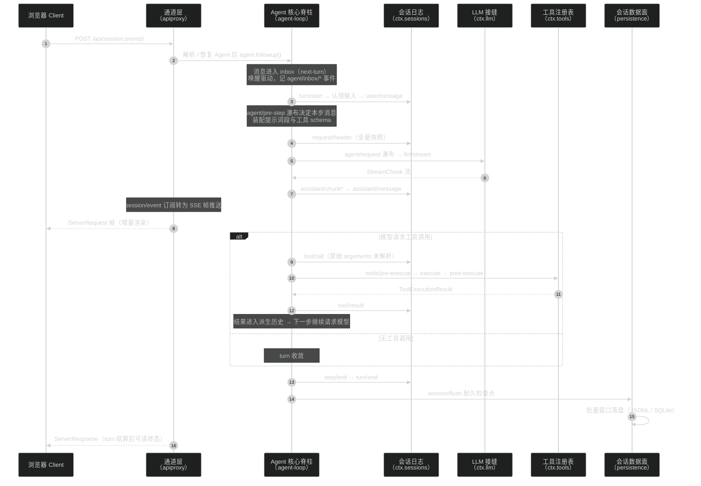
```mermaid
%%{init: {'theme':'dark', 'themeVariables': {'fontSize':'14px'}}}%%
sequenceDiagram
autonumber
participant Browser as 浏览器 Client
participant Host as 通道层<br/>（apiproxy）
participant Spine as Agent 核心脊柱<br/>（agent-loop）
participant Log as 会话日志<br/>（ctx.sessions）
participant LLM as LLM 接缝<br/>（ctx.llm）
participant Tools as 工具注册表<br/>（ctx.tools）
participant Store as 会话数据面<br/>（persistence）

Browser->>Host: POST /api/session.prompt
Host->>Spine: 解析 / 恢复 Agent 后 agent.followup()
Note over Spine: 消息进入 inbox（next-turn）<br/>唤醒驱动，记 agent/inbox/* 事件
Spine->>Log: turn/start → 认领输入 → user/message
Note over Spine: agent/pre-step 瀑布决定本步消息<br/>装配提示词段与工具 schema
Spine->>Log: request/header（全量快照）
Spine->>LLM: agent/request 瀑布 → llm/stream
LLM-->>Spine: StreamChunk 流
Spine->>Log: assistant/chunk* → assistant/message
Note over Host: session/event 订阅转为 SSE 帧推送
Host-->>Browser: ServerRequest 帧（增量渲染）

alt 模型请求工具调用
  Spine->>Log: tool/call（原始 arguments 未解析）
  Spine->>Tools: tools/pre-execute → execute → post-execute
  Tools-->>Spine: ToolExecutionResult
  Spine->>Log: tool/result
  Note over Spine: 结果进入派生历史 → 下一步继续请求模型
else 无工具调用
  Note over Spine: turn 收敛
end

Spine->>Log: step/end → turn/end
Spine->>Store: session/flush 耐久检查点
Store->>Store: 批量窗口落盘（JSONL / SQLite）
Host-->>Browser: ServerResponse（turn 结算后可读终态）
```

**关键事实**：`turn/*`、`step/*`、`user/message`、`assistant/*`、`tool/*` 是持久会话事件；`agent/pre-step`、`agent/request`、`llm/stream`、`tools/*` 是活的瀑布扩展点，监听者必须调用 `next()` 委托，否则短路整个链。

## 2.4 代码仓结构映射

仓库根目录精简树（省略依赖目录、构建产物与各包内部细节）：

```text
deepseek-harness/
├── AGENTS.md            # 仓库规约（约定、命令、防御模式索引）
├── package.json         # pnpm workspace 根， gates 脚本入口
├── apps/                # 可执行入口：cli（dsh 命令）、web（浏览器 SPA）
├── packages/            # 全部产品包：<group>/<pkg>/，npm 名 @deepseek-ai/dsh-<pkg>
│   ├── core/            # Agent 脊柱：session/system-prompt/tools/agent/agent-loop/scope
│   ├── llm/             # LLM 能力族：抽象服务 + deepseek/pi-ai 适配器 + retry
│   ├── session/         # 会话数据面：持久化/投影/标题/遥测
│   ├── api/             # Remote BFF 与 Typert RPC 网关
│   ├── host/  client/   # Web GUI 宿主半与浏览器半
│   ├── sdk/  acp/       # 进程外 SDK 协议栈与 ACP 自动化服务器
│   ├── bundle/  preset/ boot/  # 组合层
│   └── …                # 约 20 个能力接缝族与 util/test-support/examples
├── vendor/              # vendored Cordis 框架源码（pinned 副本）
├── python/              # Python SDK 与打包运行时
├── native/              # node-addon-landlock-run 源码
├── examples/            # 可运行的 cordis.yml 叶配置
├── docs/                # architecture、subsystems、cookbook、生成目录
└── scripts/             # 仓库门禁与生成器
```

逻辑模块 → 实际目录映射（与 2.1 职责边界表一一对应）：

| 服务/模块 | 实际目录 | 说明 |
|---|---|---|
| ① 通道层 | `packages/host/`（apiproxy、webserver）、`packages/client/`、`packages/api/`（remotes、gateway）、`packages/acp/acp/`、`packages/sdk/` | 注意包名与目录名不总一致：如 `host/apiproxy` 的 npm 名为 `@deepseek-ai/dsh-host-apiproxy` |
| ② 组合层 | `packages/bundle/`（base/web-app/headless）、`packages/preset/agent-presets/`、`packages/boot/`（app-boot、cmdline）、`packages/examples/`（demo bundle） | 可执行入口在 `apps/cli`；demo 叶配置在仓库根 `examples/` |
| ③ Agent 核心脊柱 | `packages/core/`（session、system-prompt、tools、agent、agent-loop、scope） | `scope/` 是无服务的纯库 |
| ④ 能力接缝家族 | `packages/llm/`、`shell/`、`fs/`、`subprocess/`、`terminal/`、`sandbox/`、`lsp/`、`skill/`、`web/`、`subagent/`、`compaction/`、`jobs/`、`workflow/`、`code-runtime/`、`e2b/` 等 | 每族内部按 Definition / Provider / Consumer 拆包 |
| ⑤ 会话数据面 | `packages/session/`（session-persistence 及 jsonl/sqlite 后端、projection、title、telemetry）、`packages/session-query/` | 检索族独立成组 |
| ⑥ 人机协作面 | `packages/interaction/`（commands、user-approval、permission-presets、tool-ask-user、user-questions） | —— |

---

# 3 服务/模块详设

本章按依赖顺序展开：3.1 会话日志（一切的事实源）→ 3.2 Agent 与驱动循环 → 3.3 工具管线 → 3.4 LLM 接缝 → 3.5 会话数据面 → 3.6 能力接缝家族（模式归纳）→ 3.7 组合层 → 3.8 通道层。

## 3.1 会话日志（core/session）

事件溯源的会话模型：一个 `Session` 是 append-only 的 `SessionEvent` 日志，是 agent 全部交互历史的唯一事实源；LLM 消息历史由日志**派生**（`deriveMessages()`），从不单独存储，回放即重派生。持久化不在本包——持久化插件订阅 `session/event` 并在 `session/flush` 落盘（见 3.5）。

### 3.1.1 对外提供的接口

`ctx.sessions`（`SessionStore`）方法级清单：

| 接口/方法 | 契约（一句话） | 调用方 |
|---|---|---|
| `create(id?, options?)` | 创建并发布会话（seed 可回放/fork，meta 成为不可变 SessionHeader） | 宿主插件、测试 |
| `prepare / enter / announce` | 三段式创建：构造不入店 → 安装发布钩子 → 发布创建事件；供 agent 工厂把会话生命周期折叠进单个有序 effect | agent-loop 工厂 |
| `flush(session)` | 耐久检查点：等待全部持久化监听者把缓冲事件落盘 | 检查点策略、读取存储前的消费者 |
| `fork(source, boundary?, childSessionId?)` | 从存活会话的稳定前缀（不得结束于未关闭 turn 内）创建子会话 | subagent、Web `session.fork` |
| `get / list` | 查询存活会话 | 通道层、遥测 |

`Session` 实例本身的关键方法：`append(type, data, surfaceIntent?)`（追加事件，JSON 可序列化校验失败即抛）、`deriveMessages()`（派生模型历史，按 surface 节点缓存）、`requestHeader()` / `requestContext()`（折叠最新请求信封与路由元数据）。`SessionEventMap` 是声明合并可扩展的事件词汇表：核心含 `turn/start`、`turn/end`、`step/start`、`step/end`、`user/message`、`assistant/chunk`、`assistant/message`、`tool/call`、`tool/result`、`todo/write`、`request/header`、`request/context`、`session/end-seed`；插件（如 compaction、hooks）可合并自己的 log-only 事件。

### 3.1.2 内部结构

领域型模块：难点在"规则守在哪"——事件合法性、surface 转移、派生投影的规则全部收口在 Session 聚合与 surface 管理器上。

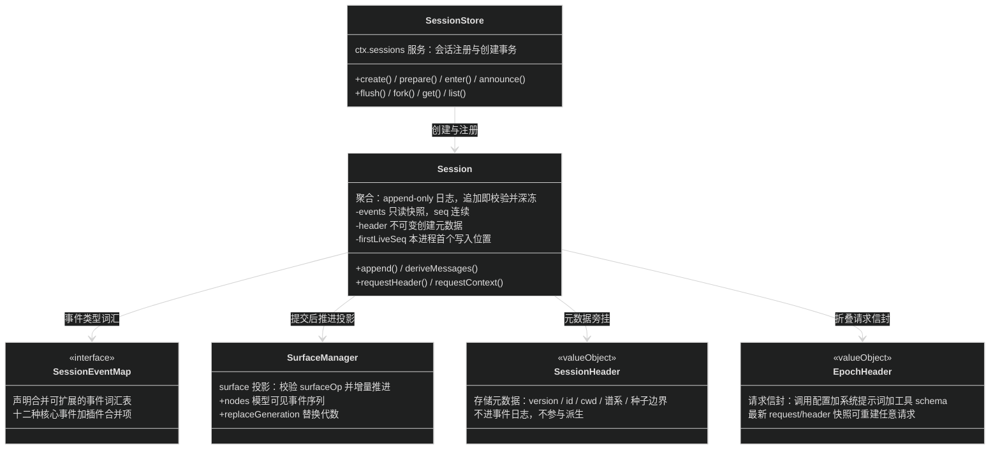
```mermaid
%%{init: {'theme':'dark', 'themeVariables': {'fontSize':'14px'}}}%%
classDiagram
    class SessionStore {
        ctx.sessions 服务：会话注册与创建事务
        +create() / prepare() / enter() / announce()
        +flush() / fork() / get() / list()
    }
    class Session {
        聚合：append-only 日志，追加即校验并深冻
        -events 只读快照，seq 连续
        -header 不可变创建元数据
        -firstLiveSeq 本进程首个写入位置
        +append() / deriveMessages()
        +requestHeader() / requestContext()
    }
    class SessionEventMap {
        <<interface>>
        声明合并可扩展的事件词汇表
        十二种核心事件加插件合并项
    }
    class SurfaceManager {
        surface 投影：校验 surfaceOp 并增量推进
        +nodes 模型可见事件序列
        +replaceGeneration 替换代数
    }
    class SessionHeader {
        <<valueObject>>
        存储元数据：version / id / cwd / 谱系 / 种子边界
        不进事件日志，不参与派生
    }
    class EpochHeader {
        <<valueObject>>
        请求信封：调用配置加系统提示词加工具 schema
        最新 request/header 快照可重建任意请求
    }

    SessionStore --> Session : 创建与注册
    Session --> SessionEventMap : 事件类型词汇
    Session --> SurfaceManager : 提交后推进投影
    Session --> SessionHeader : 元数据旁挂
    Session --> EpochHeader : 折叠请求信封
```

**核心不变量**：

- **seq = log.length**：事件序号连续无空洞（含原始 chunk），持久化后端因此可原样存储规范日志；
- **模型可见 ⟺ 已落盘**：任何进入模型请求的内容必须可从日志重建；新增模型可见输入必须新增会话事件；`request/header` 全量快照使每次请求成为日志的纯函数；
- **追加即承诺**：`append` 一次性完成 JSON 可序列化校验、深拷贝与深冻；观察者在提交后异步通知，其失败被收容、不影响已提交的追加。

### 3.1.3 内部协作时序

核心场景：**一次 `append` 的完整路径**（校验 → 提交 → 发布 → 派生缓存）。

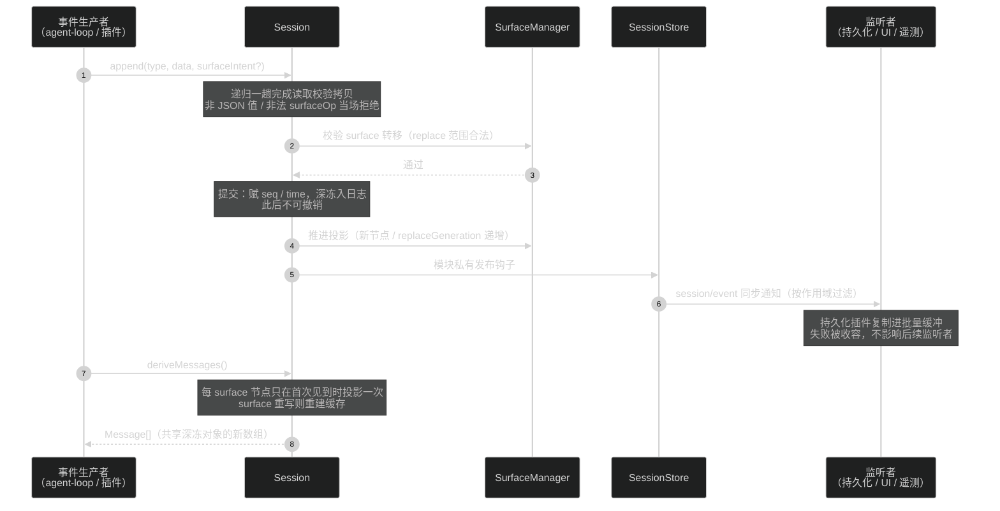
```mermaid
%%{init: {'theme':'dark', 'themeVariables': {'fontSize':'14px'}}}%%
sequenceDiagram
autonumber
participant Producer as 事件生产者<br/>（agent-loop / 插件）
participant S as Session
participant SM as SurfaceManager
participant Store as SessionStore
participant Obs as 监听者<br/>（持久化 / UI / 遥测）

Producer->>S: append(type, data, surfaceIntent?)
Note over S: 递归一趟完成读取校验拷贝<br/>非 JSON 值 / 非法 surfaceOp 当场拒绝
S->>SM: 校验 surface 转移（replace 范围合法）
SM-->>S: 通过
Note over S: 提交：赋 seq / time，深冻入日志<br/>此后不可撤销
S->>SM: 推进投影（新节点 / replaceGeneration 递增）
S->>Store: 模块私有发布钩子
Store->>Obs: session/event 同步通知（按作用域过滤）
Note over Obs: 持久化插件复制进批量缓冲<br/>失败被收容，不影响后续监听者
Producer->>S: deriveMessages()
Note over S: 每 surface 节点只在首次见到时投影一次<br/>surface 重写则重建缓存
S-->>Producer: Message[]（共享深冻对象的新数组）
```

**代码索引**——`packages/core/session/src/` 精简树：

```text
packages/core/session/src/
├── index.ts      # SessionStore（ctx.sessions）与创建事务
├── types.ts      # SessionEventMap / SessionEvent / SessionHeader / SurfaceOp
├── surface.ts    # SurfaceManager、foldSurface、deriveEventMessage
├── request-header.ts  # EpochHeader 折叠与比较
├── preparation.ts     # prepare/enter/announce 三段式创建
├── repair.ts          # 崩溃修复（合成 interrupted turn/end）
└── invariant.ts       # 运行时不变量（turn/step 编号、配对关系）
```

| 类图节点 | 源文件 |
|---|---|
| SessionStore | `packages/core/session/src/index.ts` |
| Session | `packages/core/session/src/index.ts`（`Session` 类）与 `types.ts` |
| SessionEventMap / SessionEvent | `packages/core/session/src/types.ts` |
| SurfaceManager | `packages/core/session/src/surface.ts` |
| SessionHeader / EpochHeader | `packages/core/session/src/types.ts` / `request-header.ts` |

## 3.2 Agent 契约与驱动循环（core/agent + core/agent-loop）

`core/agent` 声明公共契约：`Agent` 句柄、存活注册表 `ctx.agents`、`agent/*` 事件词汇——扩展插件只依赖它；`core/agent-loop` 是契约的唯一具体实现（默认产品循环，`ctx.agentLoop`），可整体替换。两者分层保证"换循环不换生态"。

### 3.2.1 对外提供的接口

**`Agent` 句柄**（一切插件——UI、hooks、编排器——编程的对象）：

| 接口/方法 | 契约（一句话） | 调用方 |
|---|---|---|
| `followup(message)` | 排队一个普通后续 turn 并唤醒驱动 | 通道层 |
| `steer(message)` | 向最近一个 step 边界投递转向输入（运行中被下一步认领） | UI 转向、hooks |
| `inject(message)` | 排队模型可见上下文，不唤醒驱动 | 上下文插件、subagent 回执 |
| `send(message, target, wakeup)` | 统一入口：路由到 next-turn / next-step 边界并选择是否唤醒 | 上述别名的底层 |
| `cancel(cause, options?)` | 中止活动中的 turn / 维护任务，`keepInbox` 可保留排队工作 | UI 停止按钮、父代理 |
| `whenIdle()` | 整个 agent 收敛静止后兑现 | ACP prompt 结算、SDK |
| `runMaintenance(task)` | 在真空转相位运行非 turn 维护任务 | compaction 等 |

**`ctx.agents`（AgentRegistry）**：`create / resume`（经注册的工厂创建）、`register / enter / announce`（存活登记）、`get / list / roots / isOwnedBy`（查询）、`setFactory`（循环注册工厂）、`withInitiator / currentInitiator / requireInitiator / withoutInitiator`（进程内归因作用域）。

**`agent/*` 事件**：`agent/created`、`agent/disposed`、`agent/status`、`agent/error`、`agent/inbox/*` 为 emit；`agent/pre-step`（拒绝或替换进入 step 的消息批）、`agent/request`（替换冻结的调用配置）、`agent/request-error`（失败恢复，返回 `{kind:'retry'}` 接管）为瀑布；`agent/turn-stopping` 为串行无 `next()`。

### 3.2.2 内部结构

编排型模块：难点在"流程怎么串"——turn/step 状态机、inbox 认领、瀑布链、工具调度与取消收敛。

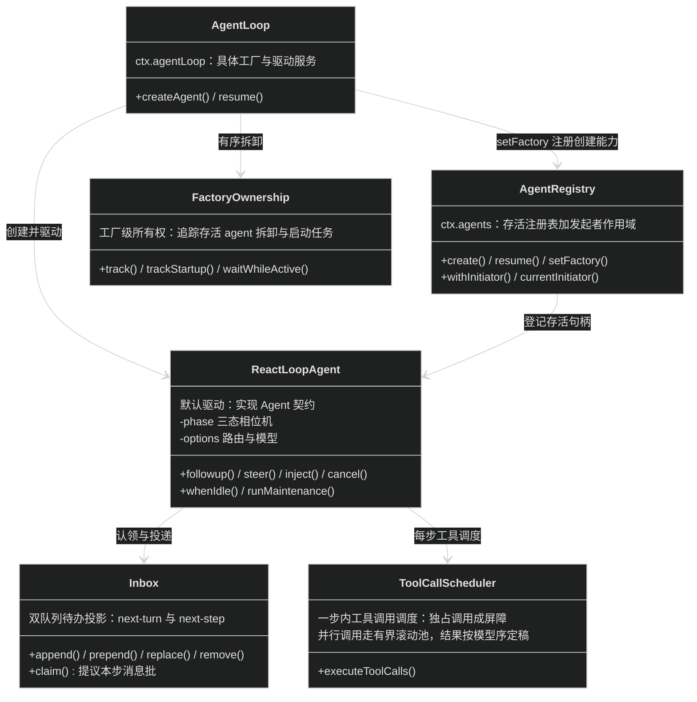
```mermaid
%%{init: {'theme':'dark', 'themeVariables': {'fontSize':'14px'}}}%%
classDiagram
    class AgentRegistry {
        ctx.agents：存活注册表加发起者作用域
        +create() / resume() / setFactory()
        +withInitiator() / currentInitiator()
    }
    class AgentLoop {
        ctx.agentLoop：具体工厂与驱动服务
        +createAgent() / resume()
    }
    class ReactLoopAgent {
        默认驱动：实现 Agent 契约
        -phase 三态相位机
        -options 路由与模型
        +followup() / steer() / inject() / cancel()
        +whenIdle() / runMaintenance()
    }
    class Inbox {
        双队列待办投影：next-turn 与 next-step
        +append() / prepend() / replace() / remove()
        +claim() 提议本步消息批
    }
    class ToolCallScheduler {
        一步内工具调用调度：独占调用成屏障
        并行调用走有界滚动池，结果按模型序定稿
        +executeToolCalls()
    }
    class FactoryOwnership {
        工厂级所有权：追踪存活 agent 拆卸与启动任务
        +track() / trackStartup() / waitWhileActive()
    }

    AgentLoop --> AgentRegistry : setFactory 注册创建能力
    AgentLoop --> ReactLoopAgent : 创建并驱动
    AgentLoop --> FactoryOwnership : 有序拆卸
    ReactLoopAgent --> Inbox : 认领与投递
    ReactLoopAgent --> ToolCallScheduler : 每步工具调度
    AgentRegistry --> ReactLoopAgent : 登记存活句柄
```

相位机（`Phase`）：`idle`（无驱动活动）⇄ `running`（含 turn 编号与 step 编号）／`maintenance`（维护任务），`cancel` 使首因生效，`whenIdle` 跟随替代工作直到静止。对外状态只暴露 `idle | running` 两值（`agent/status` 每次跃迁镜像发出）；dispose 不是第三种状态，而是移出注册表。

**并发模型**：每个 agent 同时只有一个驱动者持有 running/maintenance 相位（单线程语义的协作式并发）；并行只出现在一步内的工具调用——`isConcurrencySafe` 声明为 true 的调用进入有界滚动池，独占调用构成屏障，结果始终按模型产生的顺序定稿；abort 为跳过的调用补记合成错误结果，保证回放合法。

### 3.2.3 内部协作时序

核心场景：**一个含工具调用的 turn**（与 2.3 的脊柱段一一对应，此处下钻到类级）。

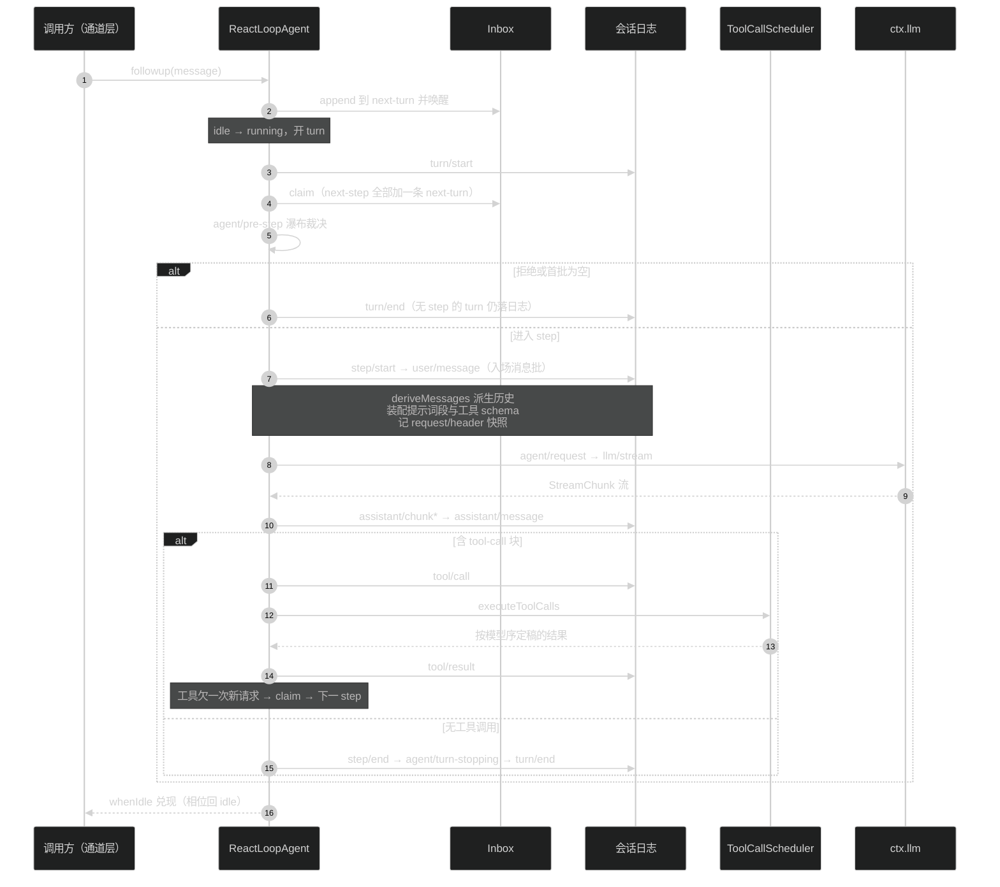
```mermaid
%%{init: {'theme':'dark', 'themeVariables': {'fontSize':'14px'}}}%%
sequenceDiagram
autonumber
participant Caller as 调用方（通道层）
participant A as ReactLoopAgent
participant Inbox
participant Session as 会话日志
participant Sched as ToolCallScheduler
participant Llm as ctx.llm

Caller->>A: followup(message)
A->>Inbox: append 到 next-turn 并唤醒
Note over A: idle → running，开 turn
A->>Session: turn/start
A->>Inbox: claim（next-step 全部加一条 next-turn）
A->>A: agent/pre-step 瀑布裁决
alt 拒绝或首批为空
  A->>Session: turn/end（无 step 的 turn 仍落日志）
else 进入 step
  A->>Session: step/start → user/message（入场消息批）
  Note over A,Session: deriveMessages 派生历史<br/>装配提示词段与工具 schema<br/>记 request/header 快照
  A->>Llm: agent/request → llm/stream
  Llm-->>A: StreamChunk 流
  A->>Session: assistant/chunk* → assistant/message
  alt 含 tool-call 块
    A->>Session: tool/call
    A->>Sched: executeToolCalls
    Sched-->>A: 按模型序定稿的结果
    A->>Session: tool/result
    Note over A: 工具欠一次新请求 → claim → 下一 step
  else 无工具调用
    A->>Session: step/end → agent/turn-stopping → turn/end
  end
end
A-->>Caller: whenIdle 兑现（相位回 idle）
```

**代码索引**——精简树：

```text
packages/core/agent/src/
├── index.ts          # AgentRegistry（ctx.agents）与 AgentFactory
├── types.ts          # Agent 句柄、AgentOptions、PreStepDecision
├── inbox.ts          # Inbox 双队列投影
├── runtime-types.ts  # agent/* 事件声明合并
└── dispatch.ts       # 作用域过滤的事件派发

packages/core/agent-loop/src/
├── index.ts          # AgentLoop 服务与工厂所有权
├── agent.ts          # ReactLoopAgent 默认驱动
├── tool-calls.ts     # ToolCallScheduler
└── runtime-context.ts # 运行时上下文投影
```

| 类图节点 | 源文件 |
|---|---|
| AgentRegistry | `packages/core/agent/src/index.ts` |
| Agent 句柄 / 事件词汇 | `packages/core/agent/src/types.ts` / `runtime-types.ts` |
| Inbox | `packages/core/agent/src/inbox.ts` |
| AgentLoop / FactoryOwnership | `packages/core/agent-loop/src/index.ts` |
| ReactLoopAgent | `packages/core/agent-loop/src/agent.ts` |
| ToolCallScheduler | `packages/core/agent-loop/src/tool-calls.ts` |

## 3.3 工具管线（core/tools + core/system-prompt）

`ctx.tools` 是带作用域的工具注册表与受守护的执行管线：注册的是 `ToolDefinition`（模型可见 `ToolSchema` + 强制输出声明 + `execute` 函数 + 可选 UI 呈现回调）；`ctx.systemPrompt` 负责提示词段与工具 schema 的装配，两者共同决定模型在每个 step 看到什么。

### 3.3.1 对外提供的接口

| 接口/方法 | 契约（一句话） | 调用方 |
|---|---|---|
| `defineTool(spec)` DSL | 以类型化 schema（参数 + 输出）构建 ToolDefinition，校验并收窄入参 | 工具作者插件 |
| `ctx.tools.register(def)` | 注册工具，返回 disposer；schema 进入提示词装配 | 工具插件 |
| `ctx.tools.schemas()` | 按显式白名单产出模型可见 `ToolSchema[]`（execute / timeoutMs 等永不泄漏） | agent-loop 装配 |
| `ctx.tools.execute(...)` | 受守护执行：`tools/pre-execute` → `tools/execute`（瀑布，可拦截/超时包装）→ `tools/post-execute` → 规范化定稿 | agent-loop 调度器 |
| `ctx.systemPrompt` | 提示词段注册与渲染、工具 schema 装配 | agent-loop、上下文插件 |

错误语义：工具体抛错被规范化为带结构化错误身份（`error.name/code`）的 `ToolExecutionResult`，最终以 `tool/result` 事件落日志；管线失败（如超时）与工具失败走同一条定稿路径。

### 3.3.2 内部结构

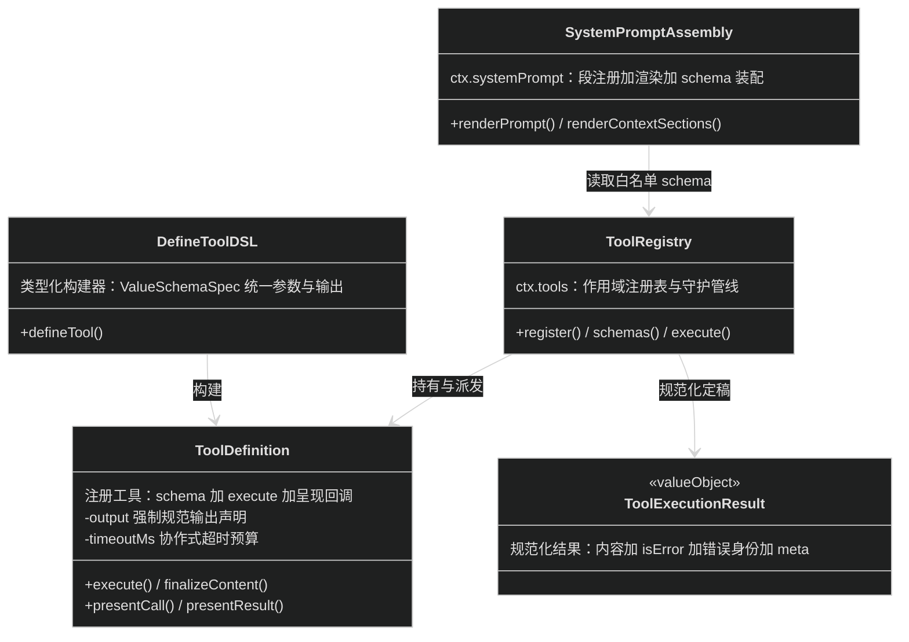
```mermaid
%%{init: {'theme':'dark', 'themeVariables': {'fontSize':'14px'}}}%%
classDiagram
    class ToolRegistry {
        ctx.tools：作用域注册表与守护管线
        +register() / schemas() / execute()
    }
    class ToolDefinition {
        注册工具：schema 加 execute 加呈现回调
        -output 强制规范输出声明
        -timeoutMs 协作式超时预算
        +execute() / finalizeContent()
        +presentCall() / presentResult()
    }
    class DefineToolDSL {
        类型化构建器：ValueSchemaSpec 统一参数与输出
        +defineTool()
    }
    class ToolExecutionResult {
        <<valueObject>>
        规范化结果：内容加 isError 加错误身份加 meta
    }
    class SystemPromptAssembly {
        ctx.systemPrompt：段注册加渲染加 schema 装配
        +renderPrompt() / renderContextSections()
    }

    DefineToolDSL --> ToolDefinition : 构建
    ToolRegistry --> ToolDefinition : 持有与派发
    ToolRegistry --> ToolExecutionResult : 规范化定稿
    SystemPromptAssembly --> ToolRegistry : 读取白名单 schema
```

**并发模型**：执行入口对取消信号做环绕替换（caller cancellation 透传给协作式工具体）；同进程代码无法硬杀，超时由 `dsh-tool-call-timeout-policy` 以 `tools/execute` 包装实现，依赖工具转发 `exec.signal` 达到静止。并行调度策略在 3.2 的 ToolCallScheduler，注册表只保证派发与定稿秩序。

### 3.3.3 内部协作时序

核心场景：**一次工具调用的守护执行**（对应 3.2.3 中 `executeToolCalls` 内部的单次派发）。

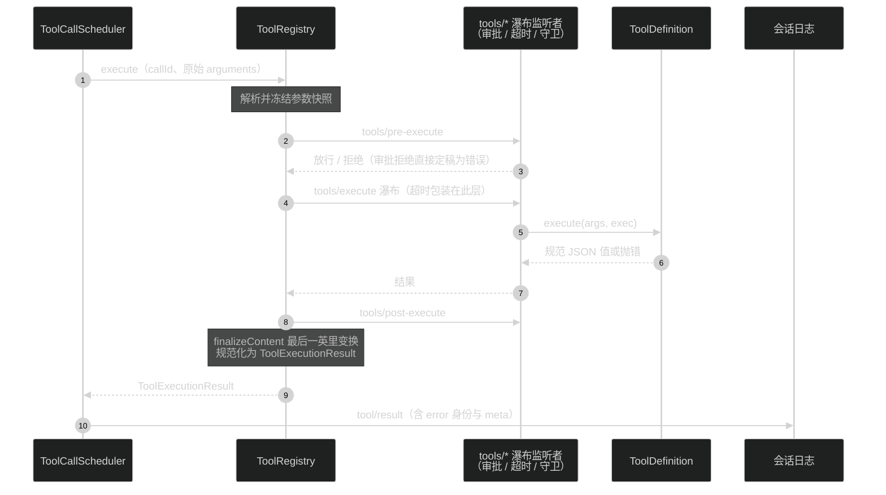
```mermaid
%%{init: {'theme':'dark', 'themeVariables': {'fontSize':'14px'}}}%%
sequenceDiagram
autonumber
participant Sched as ToolCallScheduler
participant Reg as ToolRegistry
participant Hook as tools/* 瀑布监听者<br/>（审批 / 超时 / 守卫）
participant Def as ToolDefinition
participant Session as 会话日志

Sched->>Reg: execute（callId、原始 arguments）
Note over Reg: 解析并冻结参数快照
Reg->>Hook: tools/pre-execute
Hook-->>Reg: 放行 / 拒绝（审批拒绝直接定稿为错误）
Reg->>Hook: tools/execute 瀑布（超时包装在此层）
Hook->>Def: execute(args, exec)
Def-->>Hook: 规范 JSON 值或抛错
Hook-->>Reg: 结果
Reg->>Hook: tools/post-execute
Note over Reg: finalizeContent 最后一英里变换<br/>规范化为 ToolExecutionResult
Reg-->>Sched: ToolExecutionResult
Sched->>Session: tool/result（含 error 身份与 meta）
```

**代码索引**——精简树：

```text
packages/core/tools/src/
├── index.ts         # ToolRegistry（ctx.tools）与守护管线
├── schema.ts        # ValueSchemaSpec / defineTool DSL
├── presentation.ts  # ToolCallView / ToolResultView 呈现类型
└── types.ts         # ToolDefinition / ToolExecutionResult

packages/core/system-prompt/src/
└── index.ts         # 段注册、渲染与装配（ctx.systemPrompt）
```

| 类图节点 | 源文件 |
|---|---|
| ToolRegistry | `packages/core/tools/src/index.ts` |
| ToolDefinition / ToolExecutionResult | `packages/core/tools/src/types.ts` |
| DefineToolDSL | `packages/core/tools/src/schema.ts` |
| SystemPromptAssembly | `packages/core/system-prompt/src/index.ts` |

## 3.4 LLM 接缝（llm/llm）

会话与流式词汇的声明地：`Message` / `ContentBlock` / `StreamChunk` / 模型请求信封，以及适配器接缝本身。核心包持有并记录这些值，本包定义它们；provider 适配器（`llm-deepseek`、`llm-pi-ai`）实现同一抽象，因此换供应商只是注册表里的另一次注册。

### 3.4.1 对外提供的接口

| 接口/方法 | 契约（一句话） | 调用方 |
|---|---|---|
| `ctx.llm.registerAdapter(providers, adapter)` | 为一组 provider 路由注册适配器，返回含 disposer 的句柄 | provider 插件 |
| `ctx.llm` 流式调用（经 `llm/stream` 瀑布） | 发起流式模型调用；监听者可 `next()` 到适配器或自行产出 chunk 短路 | agent-loop、llm-retry |
| `LlmAdapter`（抽象类） | provider 后端必须实现的契约：按请求产出一个逻辑流，HTTP 请求带归属标记 | 适配器作者 |
| `BlockAssembler` | 把 `StreamChunk` 流装配成 `assistant/message` | agent-loop |
| 词汇类型 | `Message` / `ContentBlockMap` / `MessageSourceMap` / `FinishReasonMap`（均声明合并可扩展） | 全仓库 |

### 3.4.2 内部结构

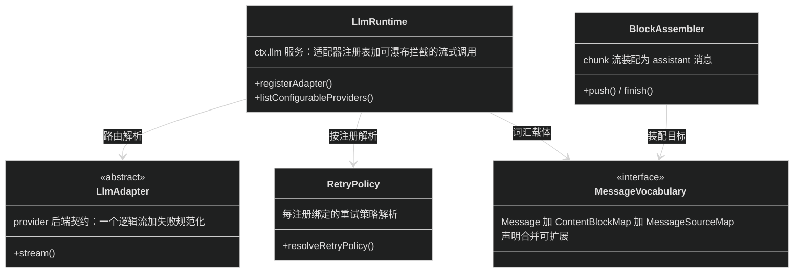
```mermaid
%%{init: {'theme':'dark', 'themeVariables': {'fontSize':'14px'}}}%%
classDiagram
    class LlmRuntime {
        ctx.llm 服务：适配器注册表加可瀑布拦截的流式调用
        +registerAdapter()
        +listConfigurableProviders()
    }
    class LlmAdapter {
        <<abstract>>
        provider 后端契约：一个逻辑流加失败规范化
        +stream()
    }
    class BlockAssembler {
        chunk 流装配为 assistant 消息
        +push() / finish()
    }
    class RetryPolicy {
        每注册绑定的重试策略解析
        +resolveRetryPolicy()
    }
    class MessageVocabulary {
        <<interface>>
        Message 加 ContentBlockMap 加 MessageSourceMap
        声明合并可扩展
    }

    LlmRuntime --> LlmAdapter : 路由解析
    LlmRuntime --> RetryPolicy : 按注册解析
    LlmRuntime --> MessageVocabulary : 词汇载体
    BlockAssembler --> MessageVocabulary : 装配目标
```

适配器实现表（主图只画抽象，实现超过 3 个时用表）：

| provider | 实现包 | 一句话职责 |
|---|---|---|
| DeepSeek 路由 | `packages/llm/llm-deepseek` | DeepSeek API 的流式适配与模型目录 |
| pi-ai 路由 | `packages/llm/llm-pi-ai` | pi-ai 协议适配 |
| 重试包装 | `packages/llm/llm-retry` | `llm/stream` 瀑布监听者，按策略重试失败请求 |

**核心不变量**：harness 发出的每个 provider HTTP 请求必须带归属（attribution）标记；循环构造的请求深冻且带 process-local 标记——其内容是会话日志的纯函数，瀑布监听者只读不改。

### 3.4.3 内部协作时序

核心场景：**一次流式请求经瀑布到适配器并装配落日志**。

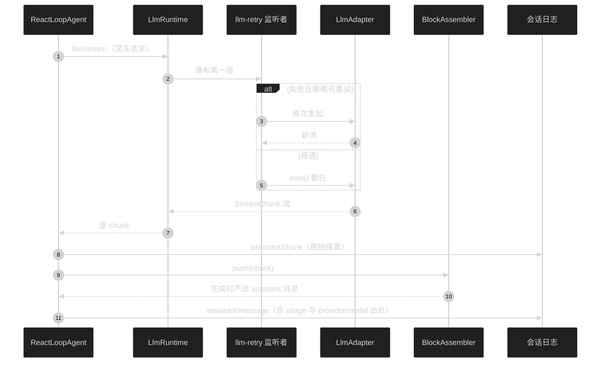
```mermaid
%%{init: {'theme':'dark', 'themeVariables': {'fontSize':'14px'}}}%%
sequenceDiagram
autonumber
participant A as ReactLoopAgent
participant RT as LlmRuntime
participant Retry as llm-retry 监听者
participant Ad as LlmAdapter
participant Asm as BlockAssembler
participant Session as 会话日志

A->>RT: llm/stream（深冻请求）
RT->>Retry: 瀑布第一层
alt 失败且策略可重试
  Retry->>Ad: 再次发起
  Ad-->>Retry: 新流
else 直通
  Retry->>Ad: next() 委托
end
Ad-->>RT: StreamChunk 流
RT-->>A: 逐 chunk
A->>Session: assistant/chunk（原始保真）
A->>Asm: push(chunk)
Asm-->>A: 完成时产出 assistant 消息
A->>Session: assistant/message（含 usage 与 provider/model 出处）
```

**代码索引**——`packages/llm/llm/src/` 精简树：

```text
packages/llm/llm/src/
├── index.ts        # LlmRuntime（ctx.llm）与 LlmAdapter 抽象
├── types.ts        # StreamChunk / 请求与结果 / ContentBlockMap
├── message.ts      # Message / MessageSourceMap / 冻结
├── assembler.ts    # BlockAssembler
├── retry-policy.ts # 重试策略解析
└── call-config.ts  # LlmCallConfig 与深冻工具
```

| 类图节点 | 源文件 |
|---|---|
| LlmRuntime / LlmAdapter | `packages/llm/llm/src/index.ts` |
| BlockAssembler | `packages/llm/llm/src/assembler.ts` |
| RetryPolicy | `packages/llm/llm/src/retry-policy.ts` |
| MessageVocabulary | `packages/llm/llm/src/types.ts` / `message.ts` |

## 3.5 会话数据面（session/*）

把内存中的事件日志变得耐久：一个抽象 `SessionPersistence` 服务（`ctx.sessionPersistence`）加两个可互换后端（JSONL / SQLite），外加语义检查点策略、投影接缝、标题与遥测。本包族不定义平行的"持久化事件类型"——持久化的就是 `SessionEvent` 本身。

### 3.5.1 对外提供的接口

| 接口/方法 | 契约（一句话） | 调用方 |
|---|---|---|
| `SessionPersistence.locate(meta)` | 同步解析后端拥有的每会话工件位置（位置提示，非授权） | 导出、诊断 |
| `SessionPersistence.load / inspect / prepare` | 逻辑加载：冷会话崩溃修复（合成 `interrupted` turn/end）、不可变检视、发布前预留 | agent-loop resume、历史读取 |
| 后端注册（JSONL / SQLite） | 同一契约的两个实现：无损 load 等于原样 append 的事件序列 | 组合层选择 |
| `session/flush`（事件） | 并行耐久屏障：所有监听者落盘后兑现 | 检查点策略、turn 边界 |
| `ctx.sessionProjections` | 投影单元注册与变更推送（标题 / 统计 / 搜索喂给通道层） | 通道层、派生插件 |
| `ctx.sessionTitle` | 标题状态与唯一模型 provider 注册位 | UI、标题 provider |

### 3.5.2 内部结构

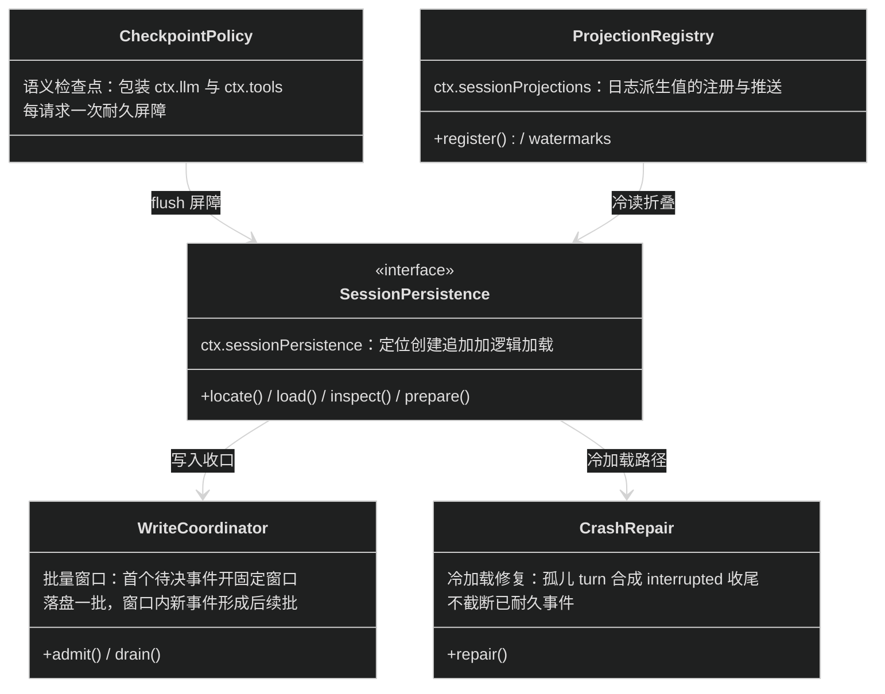
```mermaid
%%{init: {'theme':'dark', 'themeVariables': {'fontSize':'14px'}}}%%
classDiagram
    class SessionPersistence {
        <<interface>>
        ctx.sessionPersistence：定位创建追加加逻辑加载
        +locate() / load() / inspect() / prepare()
    }
    class WriteCoordinator {
        批量窗口：首个待决事件开固定窗口
        落盘一批，窗口内新事件形成后续批
        +admit() / drain()
    }
    class CrashRepair {
        冷加载修复：孤儿 turn 合成 interrupted 收尾
        不截断已耐久事件
        +repair()
    }
    class CheckpointPolicy {
        语义检查点：包装 ctx.llm 与 ctx.tools
        每请求一次耐久屏障
    }
    class ProjectionRegistry {
        ctx.sessionProjections：日志派生值的注册与推送
        +register() / watermarks
    }

    SessionPersistence --> WriteCoordinator : 写入收口
    SessionPersistence --> CrashRepair : 冷加载路径
    CheckpointPolicy --> SessionPersistence : flush 屏障
    ProjectionRegistry --> SessionPersistence : 冷读折叠
```

后端实现表：

| 后端 | 实现包 | 一句话职责 |
|---|---|---|
| JSONL | `packages/session/session-persistence-jsonl` | 每会话一个转录文件，chunk 行可打包编码但 load 还原原事件 |
| SQLite | `packages/session/session-persistence-sqlite` | 多会话共库，单调 SCHEMA_VERSION，无迁移承诺 |

**核心不变量**：`seq` 连续（chunk 不可被滤除）；后端可自选存储编码，但 `load` 必须返回与追加完全一致的事件；冷加载只修复、不截断——崩溃前已耐久的事件原样保留。

### 3.5.3 内部协作时序

核心场景：**事件从内存追加到耐久落盘**（批量窗口 + flush 屏障 + 崩溃恢复）。

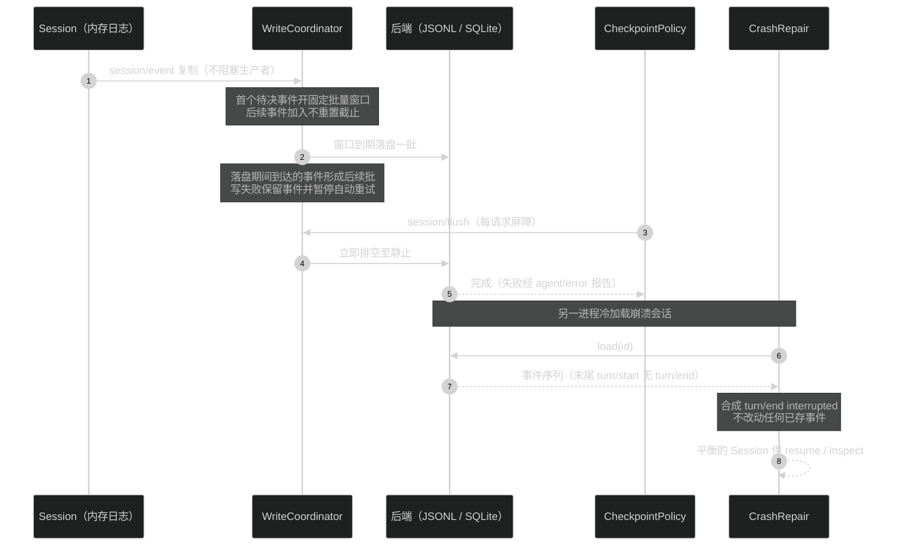
```mermaid
%%{init: {'theme':'dark', 'themeVariables': {'fontSize':'14px'}}}%%
sequenceDiagram
autonumber
participant S as Session（内存日志）
participant WC as WriteCoordinator
participant BE as 后端（JSONL / SQLite）
participant CP as CheckpointPolicy
participant CR as CrashRepair

S->>WC: session/event 复制（不阻塞生产者）
Note over WC: 首个待决事件开固定批量窗口<br/>后续事件加入不重置截止
WC->>BE: 窗口到期落盘一批
Note over WC: 落盘期间到达的事件形成后续批<br/>写失败保留事件并暂停自动重试

CP->>WC: session/flush（每请求屏障）
WC->>BE: 立即排空至静止
BE-->>CP: 完成（失败经 agent/error 报告）

Note over CR,BE: 另一进程冷加载崩溃会话
CR->>BE: load(id)
BE-->>CR: 事件序列（末尾 turn/start 无 turn/end）
Note over CR: 合成 turn/end interrupted<br/>不改动任何已存事件
CR-->>CR: 平衡的 Session 供 resume / inspect
```

**代码索引**——精简树：

```text
packages/session/
├── session-persistence/src/        # 服务定义与写入协调
├── session-persistence-jsonl/src/  # JSONL 后端
├── session-persistence-sqlite/src/ # SQLite 后端
├── session-checkpoint-policy/src/  # 语义检查点
├── session-projection/src/         # 投影注册表
└── session-title*/src/             # 标题服务与模型 provider
```

| 类图节点 | 源文件 |
|---|---|
| SessionPersistence | `packages/session/session-persistence/src/` |
| WriteCoordinator | `packages/session/session-persistence/src/` |
| CrashRepair | `packages/core/session/src/repair.ts`（逻辑）+ 各后端加载路径 |
| CheckpointPolicy | `packages/session/session-checkpoint-policy/src/` |
| ProjectionRegistry | `packages/session/session-projection/src/` |

## 3.6 能力接缝家族（模式归纳）

除核心脊柱外，全部能力按同一**三角色接缝模式**组织：**Service Definition** 声明接口（`ctx.*` 服务），**Service Provider** 实现它，**Consumer** 消费它（常见形态是模型可见工具）。一个包可兼任多角色，但只有一个角色不构成接缝；新增能力 = 设计全部三个角色。本节归纳该模式，不为每族单独画图（各族的三要素结构同构，详设从略是编写者取舍，见文首"范围与假设"）。

主要接缝族（Definition → 代表 Provider → 代表 Consumer）：

| 接缝 | ctx 键 | Provider 举例 | Consumer 举例 |
|---|---|---|---|
| LLM | `ctx.llm` | llm-deepseek / llm-pi-ai | agent-loop、llm-retry |
| Shell | `ctx.shell` | 本地 / pwsh 后端 | bash 工具 |
| 子进程 | `ctx.subprocess` | 本地进程树 provider | shell 后端、lsp |
| 文件系统 | `ctx.fs` | 本地实现 + 策略 | fs 工具族 |
| 持久终端 | `ctx.terminals` | 本地 PTY | terminal 工具 |
| 沙箱 | `ctx.sandbox` | bwrap / Landlock / Seatbelt | 消费者 spawn 前包装 argv |
| LSP | `ctx.lsp` | 通用 stdio provider | `lsp` 工具 |
| 技能 | 技能注册表 | 本地 provider | catalog / loader 工具 |
| Web | web 服务 | search / fetch provider | web 工具 |
| 子代理 | subagent 注册表 | 进程内新 agent / fork / ACP 委派 | 委派工具 |
| 压缩 | compaction 服务 | basic provider | 命令 Consumer |
| 后台任务 | `ctx.jobs` | 运行时注册表 | `job_*` 工具 |
| 工作流 | workflow 服务 | worker 线程引擎 | `workflow` / `ralph` 工具 |
| 设置 / 凭证 | `ctx.settings` / 凭证引用 | 文件 provider / env-over-.env | 配置面通道 |

**接缝的杠杆**：fs 与 subprocess provider 共享同一执行世界，因此把它们指向远程沙箱（E2B POC）时，Bash、PTY、LSP 随之整体迁移，无需分叉任何 provider。子代理 provider 在同一接口后差异最大：从进程内新建子 agent 到委派给另一个产品的一个 turn。

**驱动方式说明**：多数 Consumer 是模型可见工具（经 3.3 管线被模型调用）；少数族（如 compaction 的命令 Consumer、检查点策略）无模型面，由命令或事件驱动——这是模式内的合法形态，不构成例外。

## 3.7 组合层（bundle / preset / boot）

决定"这次启动的插件树长什么样"：bundle 是可安装的补丁层，profile 是 Harness home 中的命名叠加，preset 是每会话的 agent 组成，app-boot 是各可执行入口共享的引导胶。

### 3.7.1 对外提供的接口

| 接口/方法 | 契约（一句话） | 调用方 |
|---|---|---|
| `dsh --profile <name>` | 按 profile 的层序组合并启动插件树 | CLI 用户 |
| `--patch <file>` | 最高优先级覆盖层 | 部署者 |
| `--dump-config` | 导出本机实际启动的配置树 | 诊断 |
| `ctx.agentPresets` | preset 名册：`list / resolve / mount / composeFrom / recompose / copy / remove` 等 | 通道层、subagent |
| bundle 契约 | npm 包声明 `dsh.bundle.patch` 即成可安装补丁层 | 插件作者 |

### 3.7.2 内部结构

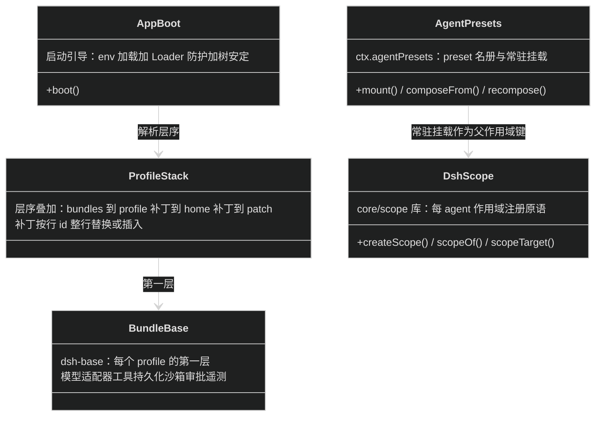
```mermaid
%%{init: {'theme':'dark', 'themeVariables': {'fontSize':'14px'}}}%%
classDiagram
    class AppBoot {
        启动引导：env 加载加 Loader 防护加树安定
        +boot()
    }
    class ProfileStack {
        层序叠加：bundles 到 profile 补丁到 home 补丁到 patch
        补丁按行 id 整行替换或插入
    }
    class BundleBase {
        dsh-base：每个 profile 的第一层
        模型适配器工具持久化沙箱审批遥测
    }
    class AgentPresets {
        ctx.agentPresets：preset 名册与常驻挂载
        +mount() / composeFrom() / recompose()
    }
    class DshScope {
        core/scope 库：每 agent 作用域注册原语
        +createScope() / scopeOf() / scopeTarget()
    }

    AppBoot --> ProfileStack : 解析层序
    ProfileStack --> BundleBase : 第一层
    AgentPresets --> DshScope : 常驻挂载作为父作用域键
```

**并发模型**：组合发生在启动与 agent 创建两个同步事务点上；preset 的发现不做记忆化（每次调用重读名册根），运行中编写的 preset 立即可见。`composeFrom` 是绑定不是挂载——子 agent 继承父 agent 那一代组合的确切实例（同一些插件对象），避免名册在父子之间被重读出不同代际。

### 3.7.3 内部协作时序

核心场景：**`dsh --profile web` 的启动**与**创建一个挂到 preset 的 agent**。

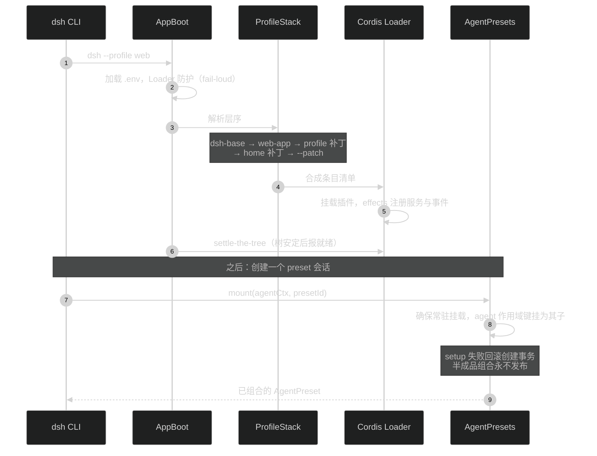
```mermaid
%%{init: {'theme':'dark', 'themeVariables': {'fontSize':'14px'}}}%%
sequenceDiagram
autonumber
participant CLI as dsh CLI
participant Boot as AppBoot
participant Stack as ProfileStack
participant Loader as Cordis Loader
participant Presets as AgentPresets

CLI->>Boot: dsh --profile web
Boot->>Boot: 加载 .env，Loader 防护（fail-loud）
Boot->>Stack: 解析层序
Note over Stack: dsh-base → web-app → profile 补丁<br/>→ home 补丁 → --patch
Stack->>Loader: 合成条目清单
Loader->>Loader: 挂载插件，effects 注册服务与事件
Boot->>Loader: settle-the-tree（树安定后报就绪）

Note over CLI,Presets: 之后：创建一个 preset 会话
CLI->>Presets: mount(agentCtx, presetId)
Presets->>Presets: 确保常驻挂载，agent 作用域键挂为其子
Note over Presets: setup 失败回滚创建事务<br/>半成品组合永不发布
Presets-->>CLI: 已组合的 AgentPreset
```

**代码索引**——精简树：

```text
packages/boot/app-boot/src/      # 启动引导与 profile 解析
packages/bundle/base/            # dsh-base（cordis.patch.yml 即其本体）
packages/bundle/web-app/         # Web 层补丁 + 运行胶
packages/bundle/headless/        # 一次性任务层
packages/preset/agent-presets/src/  # preset 名册与常驻挂载
packages/core/scope/src/         # 作用域原语库
```

| 类图节点 | 源文件 |
|---|---|
| AppBoot | `packages/boot/app-boot/src/` |
| ProfileStack / BundleBase | `packages/boot/app-boot/`（解析）+ `packages/bundle/base/cordis.patch.yml` |
| AgentPresets | `packages/preset/agent-presets/src/index.ts` |
| DshScope | `packages/core/scope/src/` |

## 3.8 通道层（host / client / api / acp / sdk）

把外部请求翻译成对 `ctx.agents` 的驱动，并把 `session/event` 等事实流转成各自的推送协议。四种通道共享同一 agent 脊柱，行为一致性由"都驱动同一个 `Agent` 句柄"保证。

### 3.8.1 对外提供的接口

四类通道的线级契约已在 **2.2 节**完整定义（Web RPC 四象限报文与错误码、ACP 方法表、SDK 方法表），此处不重复；本节从内部视角说明职责切分：

| 通道 | 契约（一句话） | 调用方 |
|---|---|---|
| Host RPC 网关（`ctx.apiProxy` + Typert Remote） | 域方法实现 + 身份策略 + SSE 推送多路复用；本身不注册路由，由载体包裹 | webserver / client connection |
| HTTP 服务器（`ctx.webServer`） | 路由载体，托管 RPC 载体、SPA 静态资源、session.export 下载 | 浏览器 |
| ACP 服务器 | stdio 上开 `AgentSideConnection`，按 branded session id 路由事件与权限请求 | ACP 客户端 |
| SDK 服务器 / 客户端 | stdio NDJSON JSON-RPC：服务器转发全量会话事件流，TS / Python 客户端各自实现 | 进程外程序 |

### 3.8.2 内部结构

以 Web 通道为主图（其余通道结构同构、更简单）：

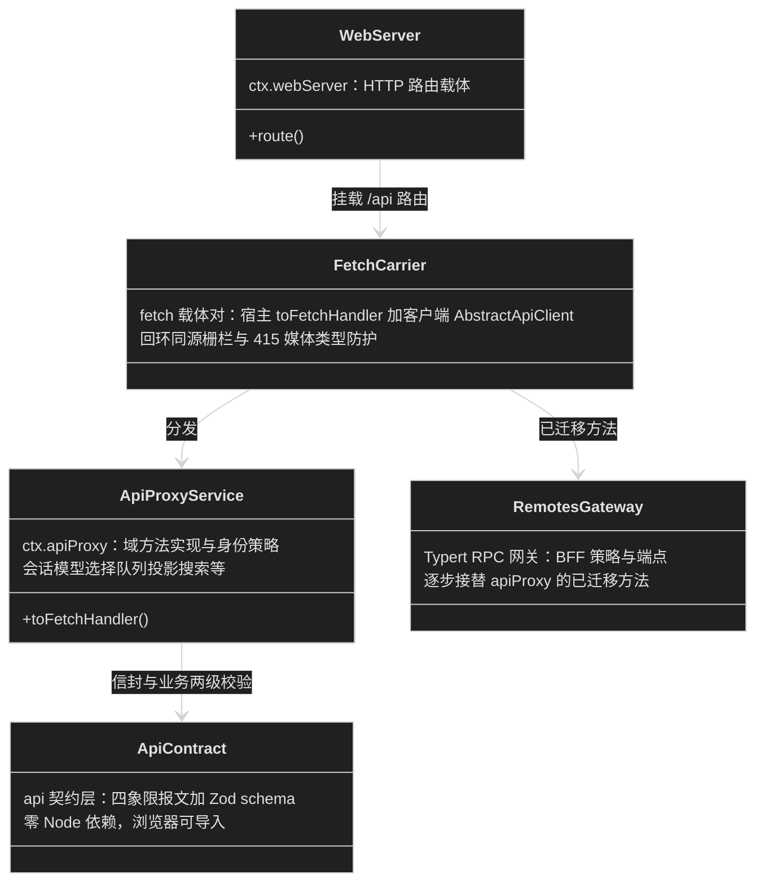
```mermaid
%%{init: {'theme':'dark', 'themeVariables': {'fontSize':'14px'}}}%%
classDiagram
    class ApiContract {
        api 契约层：四象限报文加 Zod schema
        零 Node 依赖，浏览器可导入
    }
    class ApiProxyService {
        ctx.apiProxy：域方法实现与身份策略
        会话模型选择队列投影搜索等
        +toFetchHandler()
    }
    class FetchCarrier {
        fetch 载体对：宿主 toFetchHandler 加客户端 AbstractApiClient
        回环同源栅栏与 415 媒体类型防护
    }
    class WebServer {
        ctx.webServer：HTTP 路由载体
        +route()
    }
    class RemotesGateway {
        Typert RPC 网关：BFF 策略与端点
        逐步接替 apiProxy 的已迁移方法
    }

    WebServer --> FetchCarrier : 挂载 /api 路由
    FetchCarrier --> ApiProxyService : 分发
    FetchCarrier --> RemotesGateway : 已迁移方法
    ApiProxyService --> ApiContract : 信封与业务两级校验
```

**并发模型**：网关无状态，所有会话事实从存活 `Agent` / `Session` 或持久化冷读派生；推送侧按会话订阅 `session/event` 与各注册表变更源，断线重连用基线快照（session.list / workspace.list / 投影 watermark）收敛，不靠 diff。审批类 ServerRequest 的 rpcId 稳定且重放复用，首个合法应答认领该请求。

### 3.8.3 内部协作时序

核心场景：**浏览器 prompt 的应答与推送闭环**（含一次审批问答）。

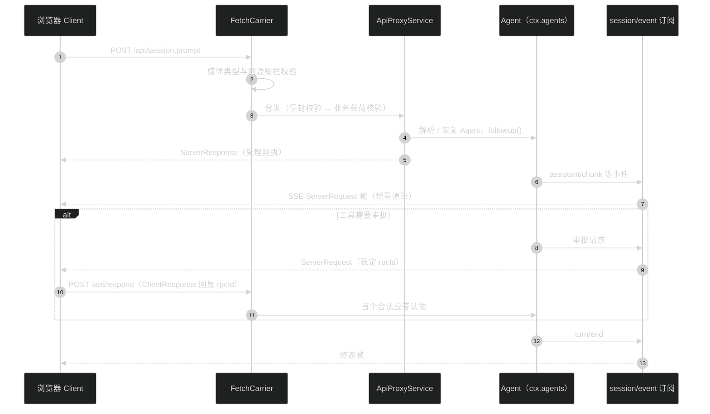
```mermaid
%%{init: {'theme':'dark', 'themeVariables': {'fontSize':'14px'}}}%%
sequenceDiagram
autonumber
participant Cl as 浏览器 Client
participant FC as FetchCarrier
participant AP as ApiProxyService
participant Ag as Agent（ctx.agents）
participant Ev as session/event 订阅

Cl->>FC: POST /api/session.prompt
FC->>FC: 媒体类型与同源栅栏校验
FC->>AP: 分发（信封校验 → 业务载荷校验）
AP->>Ag: 解析 / 恢复 Agent，followup()
AP-->>Cl: ServerResponse（受理回执）

Ag->>Ev: assistant/chunk 等事件
Ev-->>Cl: SSE ServerRequest 帧（增量渲染）

alt 工具需要审批
  Ag->>Ev: 审批请求
  Ev-->>Cl: ServerRequest（稳定 rpcId）
  Cl->>FC: POST /api/respond（ClientResponse 回显 rpcId）
  FC->>Ag: 首个合法应答认领
end

Ag->>Ev: turn/end
Ev-->>Cl: 终态帧
```

**代码索引**——精简树：

```text
packages/host/apiproxy/src/
├── api/        # 契约层：rpc.ts 四象限、rpc-map.ts、各域接口与 schema
├── fetch/      # 载体对
└── api-proxy.ts # ctx.apiProxy 实现
packages/host/webserver/src/   # HTTP 路由载体
packages/client/               # 浏览器半：shell、wire、对象服务、ui-* 插件
packages/acp/acp/src/          # ACP 服务器
packages/sdk/protocol|server|client/  # SDK 协议栈
```

| 类图节点 | 源文件 |
|---|---|
| ApiContract | `packages/host/apiproxy/src/api/` |
| ApiProxyService | `packages/host/apiproxy/src/api-proxy.ts` |
| FetchCarrier | `packages/host/apiproxy/src/fetch/` |
| WebServer | `packages/host/webserver/src/` |
| RemotesGateway | `packages/api/gateway/src/` |
