# 多租户智能体办公平台（共享资源池版）设计文档

> 基于 DeepSeek Harness（dsh）构建的多用户、共享资源池的类 ChatGPT 自主决策应用。
> 本文档的每条关键取舍均由配套[决策记录](workbuddy-pool-decisions.md)（D1~D11）承载，正文引用决策编号，不重复论证。

---

## 全局绘图规范

- 统一使用 mermaid 绘图，图源内嵌在 Markdown 中，保证可维护、可 diff；
- 每张图的节点/参与者控制在 5~9 个，超限先用 subgraph 分组归并，仍超限拆主图 + 子图；
- 模块间调用边从具体节点出发；系统级公共依赖从子图整框引带标签的归并线，图下配图例；
- 同一模块的类图、时序图、状态机图角色命名与职责一致；下层图不引入上层图未声明的顶层角色；
- 样式复用统一约定：dark theme init 头 + classDef 配色。

---

# 1 需求背景与目标

## 1.1 背景与问题

企业内部前期基于 OpenClaw 私有化版本做过一版云化托管：每个白名单用户分配一个固定 K8s Pod（2~3C），跑 OpenClaw 单实例，用户经自研 Web 页与专属实例对话。该模式存在三个硬伤：

- **资源利用率极低**：1000 个用户就要 1000 份常驻资源（约 2500C），用户不用也占着，无法向全员推广；
- **推广量级差距悬殊**：目标态是企业 30 几万员工，按 5% 并发估算约 1.5 万并发对话，老模式线性外推需要几十万核，不可行（D5）；
- **资源闲置与体验矛盾**：资源按"人"常驻分配，但真实负载按"活跃对话"波动——两头错配。

根源在于老模式把"对话引擎 + 执行环境 + 用户状态"三者打包成一个不可拆的常驻单元。本方案把三者拆开：引擎无状态共享、执行环境按活跃度池化、用户状态（会话存档 + 文件）持久化——资源只随活跃对话动态消耗（D1、D2、D8）。

## 1.2 方案目标：范围内 / 范围外

**范围内（POC 做）**

- 多租户对话引擎：一个 dsh 引擎进程同时服务多用户，会话可唤醒/驱逐，大脑层无状态、可水平扩容（D2、D8）；
- 沙箱资源池：K8s 预热 Pod 池，按人绑定、空闲保温 10~15 分钟（可配置）后回收（D4、D10）；
- 池管理器：独立部署、全局一本账，负责绑定、回收、补水、收尸（D9）；
- 用户状态持久化：会话存档入共享数据库，用户文件存企业现有 CFS 按人隔离（D8、D11）；
- AI 任务服务端续跑：用户关闭页面后任务跑完，结果可从存档完整回放（D3）；
- 模拟多用户压测：自动化模拟并发登录与真实办公行为，产出资源利用率对照报告（D7）；
- 模型接入：DeepSeek 官方 API（落地时改配置切换私有化网关）（D6）。

**范围外（POC 不做，由谁负责）**

- 长期挂服务（用户程序 7×24 保活）——将来作为独立"后台任务"功能单独设计，单独配额（D3）；
- 企业统一认证对接——POC 用模拟身份头，落地阶段由企业自研 SSO 系统对接（D7）；
- 用量配额与计费界面——落地阶段在已有的身份管道上叠加；
- 私有化模型适配——落地阶段改网关配置，无需 POC 验证（D6）；
- 按对话粒度绑沙箱——架构留有伏笔（绑定键可配置），POC 只实现按人绑定（D10）。

**关键边界**：本系统的稀缺资源管理只覆盖"活跃对话生命周期内的沙箱与引擎内存"；用户文件与会话存档是永久状态，不参与回收。

## 1.3 POC 验收标准

| # | 指标 | 目标 | 测量方式 |
|---|---|---|---|
| M1 | 同等预算并发容量 | 等比缩小的 POC 集群压出稳态并发数，线性外推到 2500C ≥ 5000 并发（即同等预算支撑注册用户数 ≥ 老模式 100 倍，按 5% 并发率折算） | 压测模拟器稳态加压，记录崩溃/劣化拐点 |
| M2 | 随叫随到 | 沙箱已回收后回访，从发消息到 AI 开始执行的冷启动耗时 p95 ≤ 10s（阈值随实测校准） | 模拟"离开 >15 分钟后回访"场景 |
| M3 | 关页不死 | 关页后任务完成率 100%，结果与会话存档一致可回放 | 模拟"发任务后立即断开连接"场景 |
| M4 | 引擎密度实测 | 单大脑进程稳态并发会话数 ≥ 500（支撑 M1 的容量模型） | 单进程加压实验 |
| M5 | 沙箱规格校准 | 真实办公任务在 0.25C / 0.5C / 1C 三档下的耗时对比，确定容量规划的规格基线 | 三档对照实验 |

---

# 2 系统总体设计

## 2.1 系统上下文与架构总览

系统由四个部分组成：Web 接入（复用 dsh web-app）、大脑集群（多租户 dsh 引擎）、池管理器（新写）、沙箱池（K8s Pod + 新 Provider）。用户状态落在两个基础设施上：会话存档入 PostgreSQL，用户文件入 CFS。

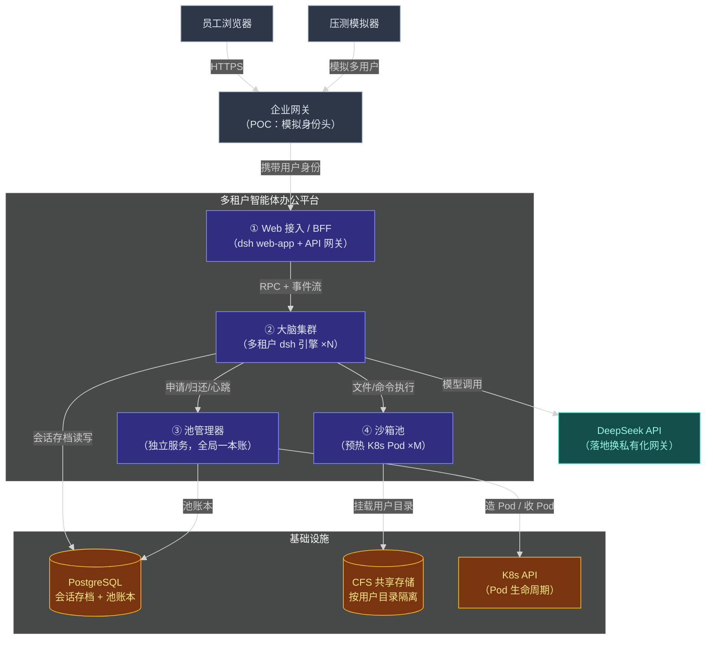

| 服务/模块 | 定位 | 核心职责 |
|---|---|---|
| **① Web 接入 / BFF** | 接入面，无状态 | 会话与文件的对外 API；事件流推送；透传网关注入的用户身份；复用 dsh web-app 与 API 网关 |
| **② 大脑集群** | 对话引擎，无状态多副本 | 多租户会话的唤醒/驻留/驱逐；对话循环与工具编排；向池管理器申请沙箱；会话存档读写 |
| **③ 池管理器** | 调度核心，独立部署 | 沙箱账本（谁绑了哪个）；空闲回收倒计时；预热池补水；大脑宕机后的孤儿沙箱收尸 |
| **④ 沙箱池** | 执行环境 | 预热 K8s Pod，绑定后挂载所属用户的 CFS 目录；承载文件读写与命令执行（办公工具链） |
| PostgreSQL | 共享存档 | 会话事件日志（追加式）+ 池管理器账本 |
| CFS | 共享文件存储 | 用户上传的文档与生成的产物，按用户目录隔离 |

## 2.2 对外提供的接口

系统对上游（浏览器 / 压测模拟器）提供 6 个接口。横切约定：POC 阶段身份由企业网关注入 `X-User-Id` 请求头（模拟多用户，D7），落地后换 SSO token 不换契约；响应壳统一 `{code, message, data}`，以下出参表只写 data 内部字段；实时事件走 SSE 长连接。传输层复用 dsh 的 API 网关与事件转发机制，本节定义逻辑契约。

| # | 方法 | 路径 | 用途 |
|---|---|---|---|
| 1 | POST | `/api/sessions` | 创建会话 |
| 2 | GET | `/api/sessions` | 列出我的会话 |
| 3 | POST | `/api/sessions/{sessionId}/prompt` | 发送任务（异步） |
| 4 | GET | `/api/sessions/{sessionId}/events` | 订阅会话事件流（SSE） |
| 5 | POST | `/api/files` | 上传文件到我的 CFS 目录 |
| 6 | GET | `/api/files/{fileId}` | 下载文件 |

### 接口③ 发送任务

`POST /api/sessions/{sessionId}/prompt`——投递一条用户消息并驱动 AI 干活；立即返回受理回执，执行过程与结果经接口④推送。**会话可以是冷的**——引擎负责唤醒，调用方无感知。

**请求参数**（Body）

| 字段 | 类型 | 必填 | 默认值 | 说明 |
|---|---|---|---|---|
| text | string | 是 | —— | 任务描述，如"把这份 Word 做成 PPT" |
| fileIds | array | 否 | `[]` | 引用的已上传文件 ID 列表 |

**响应参数**（data）

| 字段 | 类型 | 说明 |
|---|---|---|
| turnId | string | 本轮任务 ID，用于事件流中关联 |
| queued | boolean | 是否排队受理（引擎忙碌时排队而非拒绝） |

### 接口④ 订阅会话事件流

`GET /api/sessions/{sessionId}/events?fromSeq={n}`——SSE 长连接，推送该会话的全部事件（任务进度、工具调用、结果产出）；断线重连用 `fromSeq` 续传。**关页后任务续跑、回访后补看结果，都靠这个接口**（D3）。

**请求参数**（Query）

| 字段 | 类型 | 必填 | 默认值 | 说明 |
|---|---|---|---|---|
| fromSeq | number | 否 | 0 | 从哪个事件序号开始补发；0 表示全量回放 |

**响应参数**（SSE 事件 data）

| 字段 | 类型 | 说明 |
|---|---|---|
| seq | number | 事件序号，单调递增，断线重连凭据 |
| type | enum | `turn.start` / `step.progress` / `tool.call` / `turn.end` / `error` |
| payload | object | 事件内容；`turn.end` 含产出文件的 fileId 列表 |

其余四个接口从简：① `POST /api/sessions` 无业务入参（归属取身份头），返回 `{sessionId}`；② `GET /api/sessions` 返回我的会话摘要列表（`sessionId`、标题、最后活跃时间、是否有运行中任务）；⑤ `POST /api/files` 为 multipart 上传，返回 `{fileId, name, size}`；⑥ `GET /api/files/{fileId}` 直接下载文件流。四者均无嵌套结构，不再展开字段表。

错误码（只列调用方需处理的；接口③为异步受理，执行期失败不占同步响应码，经接口④的 `error` 事件透出）：

| code | 含义 | 适用接口 | 触发场景 |
|---|---|---|---|
| `0` | 成功 | 全部 | —— |
| `40101` | 身份缺失或非法 | 全部 | `X-User-Id` 缺失或格式非法 |
| `40404` | 会话不存在或无权访问 | ③④ | sessionId 不属于当前用户 |
| `40405` | 文件不存在或无权访问 | ⑤⑥ | fileId 不属于当前用户 |
| `50301` | 沙箱池暂时无空闲资源 | ③ | 池满且补水中，调用方应稍后重试 |
| `50000` | 未预期异常 | 全部 | 系统错误 |

## 2.3 核心业务场景时序

拆两张子图：**(a) 任务全流程（含关页续跑）**——最重要的故事；**(b) 空闲回收与冷启动回访**——池化经济性的关键路径。参与者与 2.1 全景图一一对应（沙箱以"池管理器/沙箱池"两个泳道出现，CFS 与 PG 合并为"存档与文件存储"泳道）。

**(a) 任务全流程**：张三发任务 → 引擎唤醒会话 → 绑沙箱 → AI 干活 → 关页续跑 → 回访看结果。

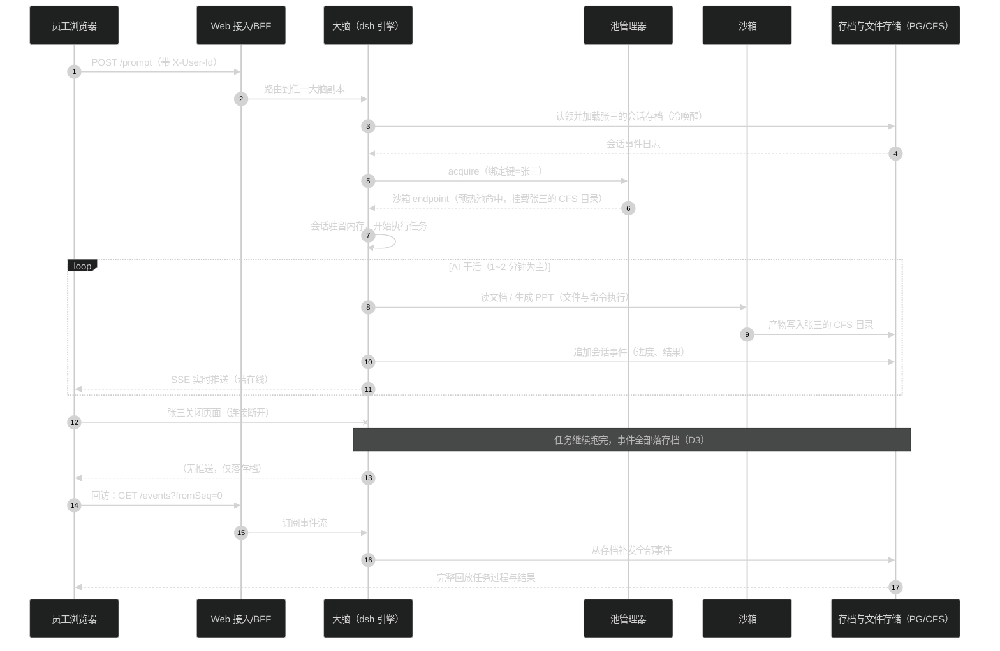

**(b) 空闲回收与冷启动回访**：任务完成 + 页面关闭 → 保温 10~15 分钟 → 沙箱回收 → 下次回访冷启动。

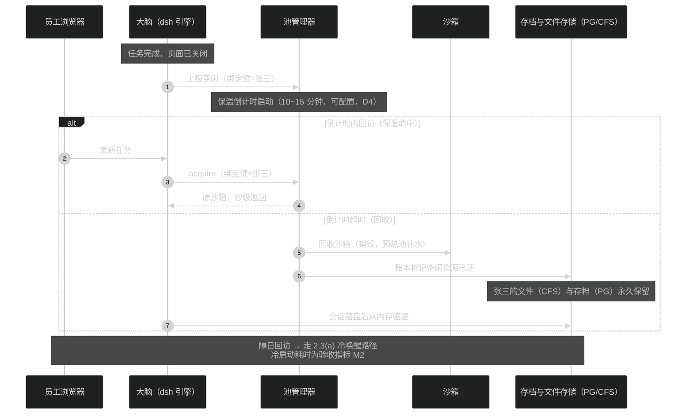

## 2.4 代码仓结构映射

本系统基于既有 DeepSeek Harness 仓构建：引擎本体、接入面、能力 seam 全部复用，新写部分为五个包（规划目录见映射表）。仓根精简树（深度 ≤ 2 层）：

```
deepseek-harness/（精简）
├── packages/
│   ├── core/          # 会话、引擎循环、工具注册（复用）
│   ├── api/           # BFF 组装与 RPC 网关（复用）
│   ├── bundle/        # web-app 等可部署组合（复用）
│   ├── session/       # 会话存档 seam 及后端（复用 seam，新增 PG 后端）
│   ├── fs/            # 文件系统 seam（复用 seam，新增沙箱后端）
│   ├── shell/         # 命令执行 seam（复用，后端经 subprocess 下钻）
│   ├── subprocess/    # 进程执行 seam（复用 seam，新增沙箱后端）
│   ├── e2b/           # 远程沙箱 Provider 原型（参照其组合方式）
│   └── pool/          # 【规划】池管理器与引擎端插件
│   └── tenant/        # 【规划】多租户身份与会话驻留插件
│   └── sandbox-k8s/   # 【规划】K8s 沙箱 Provider 与沙箱内 agent
│   └── session-persistence-pg/  # 【规划】PG 存档后端
├── examples/          # 可运行的组合样例（压测环境组合在此新增）
└── design-docs/       # 本文档与决策记录
```

| 服务/模块 | 实际目录 | 说明 |
|---|---|---|
| ① Web 接入/BFF | `packages/bundle/web-app`、`packages/api/`（gateway + remotes） | 复用；新增身份头透传配置 |
| ② 大脑集群 | `packages/core/`（引擎本体）+ `packages/tenant/`（规划：身份与驻留插件） | 引擎不改核心，多租户能力以插件挂载 |
| ③ 池管理器 | `packages/pool/`（规划） | 独立服务 + 引擎端 pool-client 插件 |
| ④ 沙箱池 | `packages/sandbox-k8s/`（规划，参照 `packages/e2b/` 的 seam 组合） | fs/subprocess seam 的 K8s Pod 实现 |
| 会话存档 | `packages/session/session-persistence`（seam）+ `packages/session-persistence-pg/`（规划） | 复用写协调器，只实现存储钩子 |
| 压测模拟器 | `examples/load-sim/`（规划） | 独立工具，经对外接口驱动 |

---

# 3 服务/模块详设

## 3.1 多租户引擎（大脑进程）

大脑是 dsh 引擎进程的多租户形态：一份 dsh 插件树组合，K8s Deployment 多副本运行，每个副本驻留多个用户的活跃会话。引擎核心（对话循环、工具编排、事件日志）不改，多租户能力全部由新插件经事件与 seam 挂接。

### 3.1.1 对外提供的接口

引擎对 BFF 的会话驱动接口复用 dsh 既有 API 网关（字段契约见 2.2，不再重复）；对池管理器的调用经 pool-client 插件（接口属 3.2，引擎是调用方）。本节列引擎新增的模块级接口：

| 接口/方法 | 契约（一句话） | 调用方 |
|---|---|---|
| `resolveTenant(request)` | 从网关注入的身份头解析用户标识，附着到会话上下文；缺失即拒绝 | BFF 请求链路 |
| `resumeSession(userId, sessionId)` | 唤醒冷会话：认领驻留权 → 从 PG 加载 → 发布为活跃 Agent；并发唤醒去重 | BFF（经 API 网关的会话解析器） |
| `evictSession(sessionId)` | 驱逐空闲会话：强制落盘 → 释放驻留权 → 从内存移除 | 驻留管理器（内部定时） |

### 3.1.2 内部结构

编排型模块，难点在"唤醒/驻留/驱逐的竞态与故障恢复"。

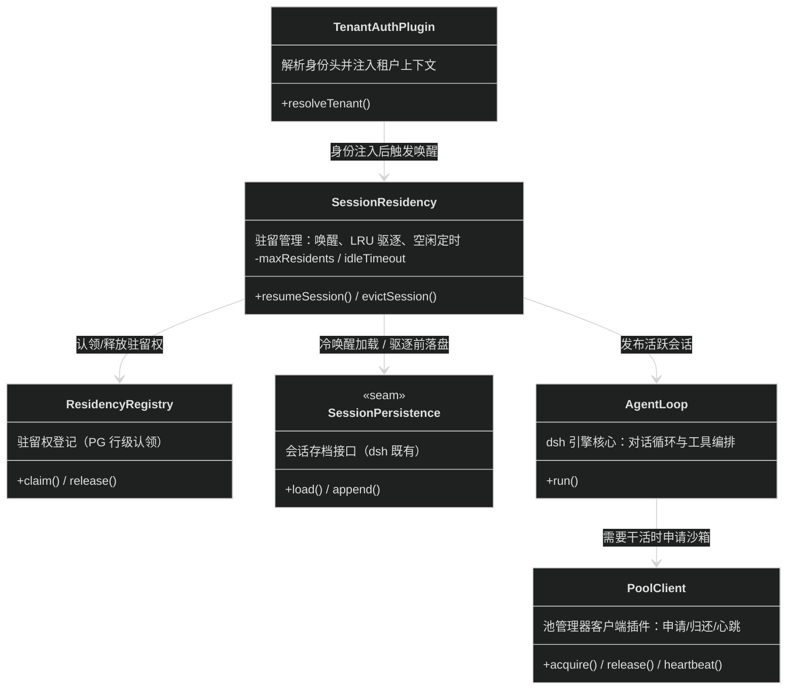

> `SessionPersistence` 与 `AgentLoop` 为 dsh 既有组件（PG 后端见 3.4）；`ResidencyRegistry` 借池管理器的 PG 存一行"sessionId → 引擎副本"的驻留登记。
>
> **并发模型**：单进程事件循环，无锁；同一 sessionId 的并发唤醒由既有会话解析器的去重机制合并；跨副本的驻留权竞争由 PG 行级原子认领收口（`UPDATE ... WHERE owner IS NULL`），失败者转发或重试。
>
> **核心不变量**：**一个 sessionId 全局至多驻留一个引擎副本**（驻留登记的原子认领保证）；**驱逐前必须落盘完成**（flush 成功才释放驻留权）；模型可见 ⇔ 已入存档（dsh 既有运行时不变量，多租户下继续成立）。

### 3.1.3 内部协作时序

核心场景：**冷会话唤醒并接棒干活**（对应 2.3(a) 的引擎段）。

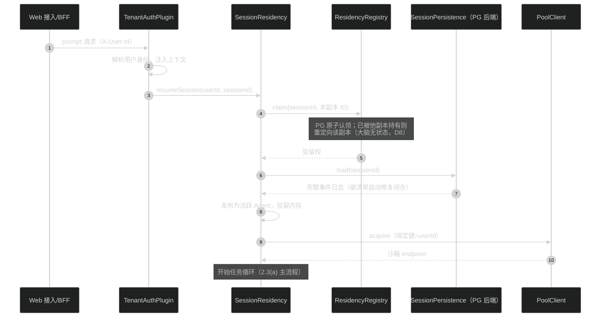

## 3.2 池管理器

池管理器是全局唯一的沙箱账本与生命周期调度者：对引擎提供申请/归还/心跳接口；内部三个定时器（回收倒计时、预热补水、孤儿收尸）驱动沙箱状态机。独立部署，POC 单副本 + 快速重启，落地主备（D9）。

### 3.2.1 对外提供的接口

| 接口/方法 | 契约（一句话） | 调用方 |
|---|---|---|
| `acquire(bindingKey, userId)` | 取一个沙箱：绑定键命中保温则原样返回，否则从预热池认领并挂载该用户 CFS 目录；同步返回 endpoint | 引擎 pool-client |
| `release(bindingKey)` | 显式归还：进入保温倒计时 | 引擎 pool-client |
| `reportIdle(bindingKey)` | 上报空闲（任务完成且无在线连接），进入保温倒计时 | 引擎 pool-client |
| `heartbeat(bindingKey)` | 续约：沙箱保持绑定，重置回收倒计时 | 引擎 pool-client |
| `stats()` | 水位指标：预热数/绑定数/保温数/回收累计，供压测报告 | 压测模拟器、运维 |

`acquire` 关键入出参：

**请求参数**

| 字段 | 类型 | 必填 | 默认值 | 说明 |
|---|---|---|---|---|
| bindingKey | string | 是 | —— | 绑定键，当前取值 = 用户 ID（可配置，D10） |
| userId | string | 是 | —— | 用户标识，决定挂载哪个 CFS 目录 |

**响应参数**

| 字段 | 类型 | 说明 |
|---|---|---|
| sandboxId | string | 沙箱唯一标识 |
| endpoint | string | 沙箱内 agent 的访问地址 |
| warm | boolean | 是否保温命中（压测区分冷热路径） |

### 3.2.2 内部结构

领域型 + 编排型混合：难点是沙箱状态机的一致性，以及三个定时器的调度。

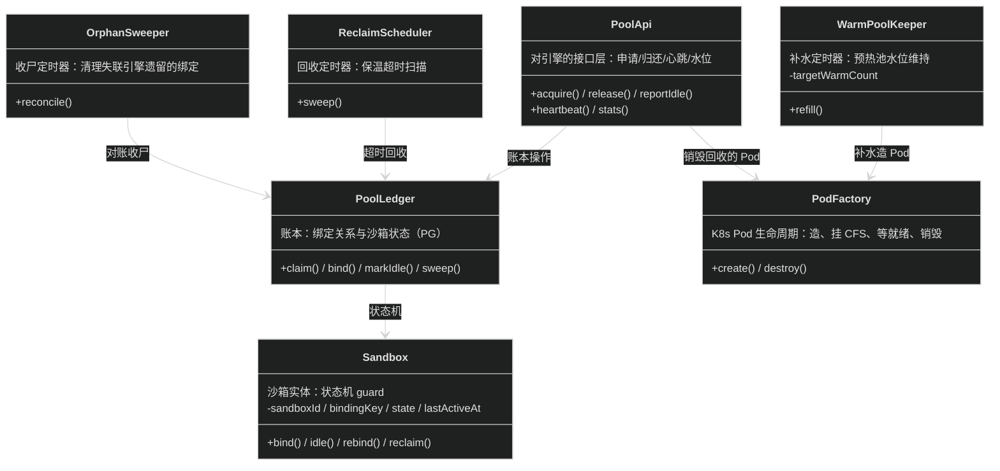

沙箱状态机——转移标签格式 `方法名() [触发方，guard]`：

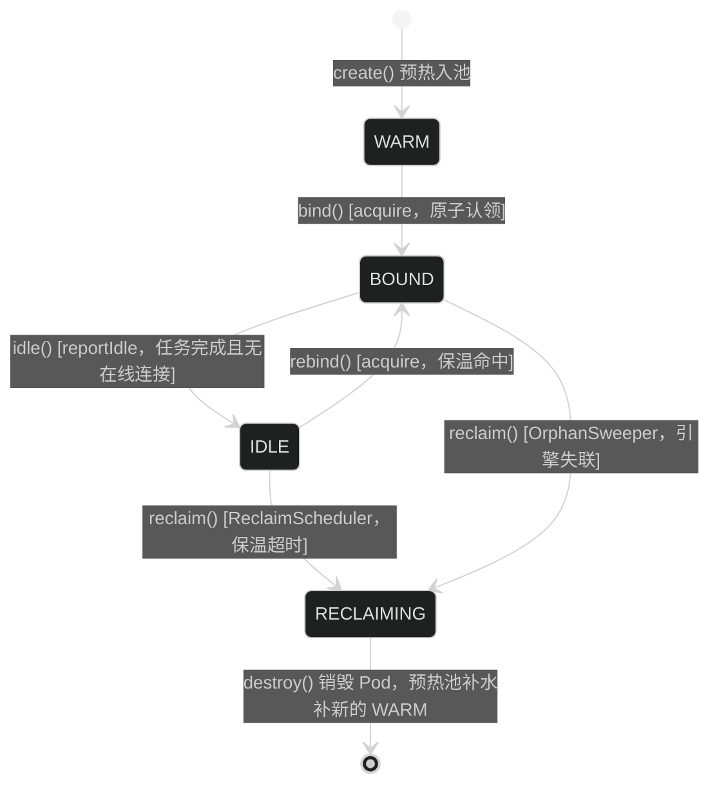

**核心不变量**：**一个绑定键全局至多持有一个非回收态沙箱**（账本唯一约束 + 原子认领保证）；**BOUND/IDLE/WARM 三态之和 ≤ 池上限**；账本与 K8s 实际 Pod 的偏差由 `OrphanSweeper` 对账收敛，以 K8s 实况为准。回收即销毁重建（不复用脏 Pod，保证用户间环境干净——此为设计默认，POC 可调整为复用 + 清理）。

**并发模型**：单进程事件循环；认领经 PG 原子 `UPDATE ... WHERE state='WARM'` 收口；三个定时器单实例运行，无分布式协调。

### 3.2.3 内部协作时序

核心场景：**acquire 冷路径**（预热池命中 → 挂载用户目录 → 交付），保温命中与回收路径以注解说明。

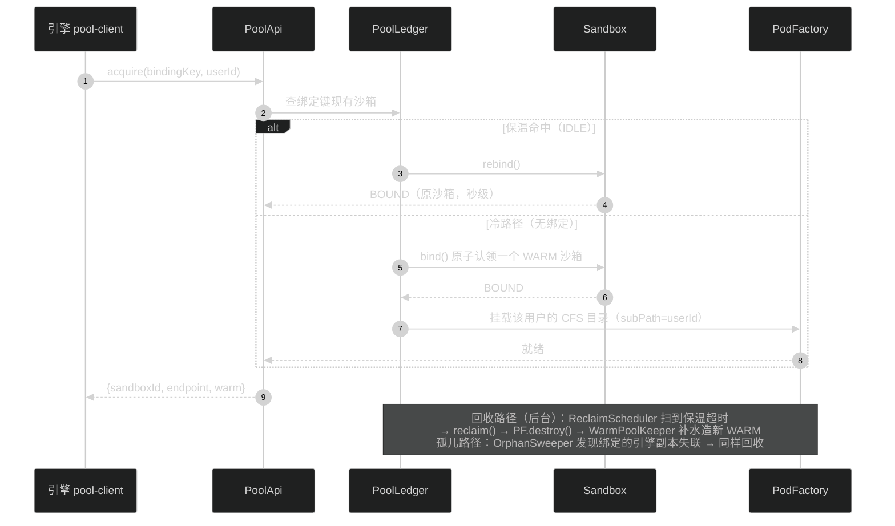

## 3.3 K8s 沙箱执行 Provider

沙箱 Provider 是 dsh 文件系统与进程执行两条 seam 的 Service Provider：引擎里的一切工具（读写文件、跑转换命令）面向 seam 编程，Provider 把操作转发到池化沙箱 Pod 内的轻量 agent。组合方式直接参照既有 e2b 三件套（`e2b` / `fs-e2b` / `subprocess-e2b`），把"E2B 后端"换成"K8s Pod 池后端"，上层工具零改动。

### 3.3.1 对外提供的接口

Provider 对引擎注册的是 dsh 既有 seam 接口（`ctx.fs`、`ctx.subprocess`，契约归 seam 的 Service Definition 所有，此处不重复展开）。新增的是沙箱 Pod 内 agent 的接口：

| 接口/方法 | 契约（一句话） | 调用方 |
|---|---|---|
| `fs/*`（读写列删） | 文件操作，作用域限定在挂载的用户 CFS 目录内 | SandboxAgentClient |
| `exec(command)` | 执行命令并回流 stdout/stderr/退出码 | SandboxAgentClient |
| 沙箱镜像 | 预装办公工具链（LibreOffice、pandoc、python-pptx 等），预热池提前拉好镜像 | —— |

### 3.3.2 内部结构

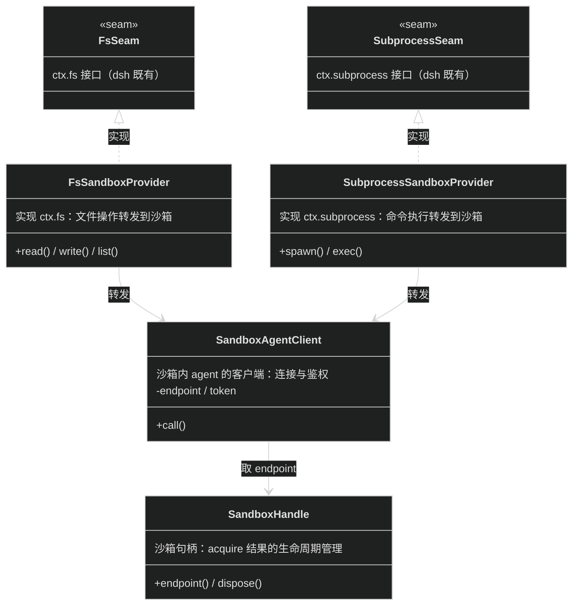

> 引擎里的 bash、文件编辑等既有工具只依赖两条 seam，挂上新 Provider 即整体迁入沙箱——这是池化方案的地基（对应决策记录 D1 的落地机制）。
>
> **并发模型**：Provider 无状态，每次调用经 `SandboxHandle` 取当前 endpoint；沙箱回收后句柄失效，后续调用触发重新 acquire（引擎侧保证同一会话串行调用，不存在半执行状态）。

### 3.3.3 内部协作时序

核心场景：**AI 调 bash 工具在沙箱里执行文档转换**。

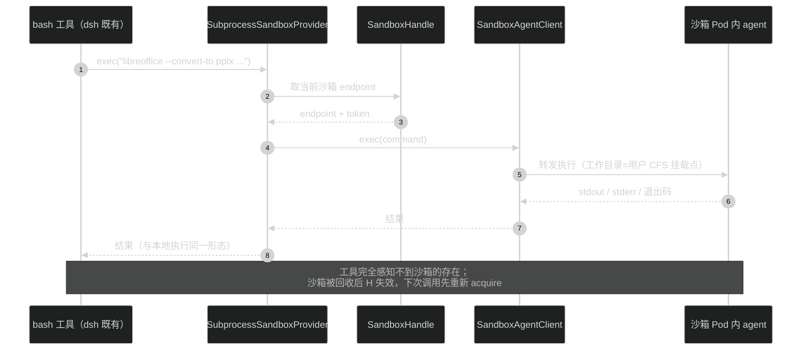

## 3.4 共享会话存档 Provider

会话存档 seam（`ctx.sessionPersistence`）的新后端：单机 JSONL/SQLite 换成 PostgreSQL，支撑"大脑无状态、任意副本唤醒"（D8）。dsh 既有的写协调器（`PersistenceCoordinator`）已收口批量写、崩溃修复、并发去重等全部生命周期正确性，新后端只需实现存储钩子接口。

### 3.4.1 对外提供的接口

实现 seam 的既有 `SessionPersistence` 接口（`create / append / load / prepare / inspect / readFrom / list` 等，契约归 Service Definition 所有）。PG 后端特有的只有一点：`list` 按用户过滤（会话归属字段随存档头写入）。

### 3.4.2 内部结构

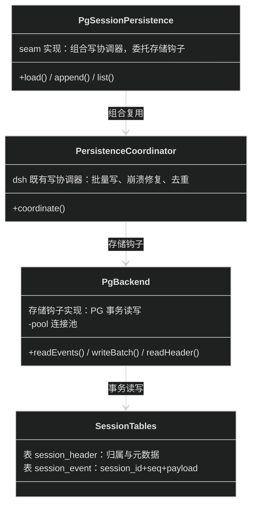

**核心不变量**（沿用 seam 约定，PG 后端不得破坏）：事件追加式、seq 连续；崩溃中断的任务在冷加载时以合成事件闭合，不截断已落库事件；`append` 返回即已持久化。PG 事务天然满足批量写的原子性。

### 3.4.3 内部协作时序

核心场景：**任务过程中的事件批量落库**（写路径；冷加载路径见 3.1.3）。

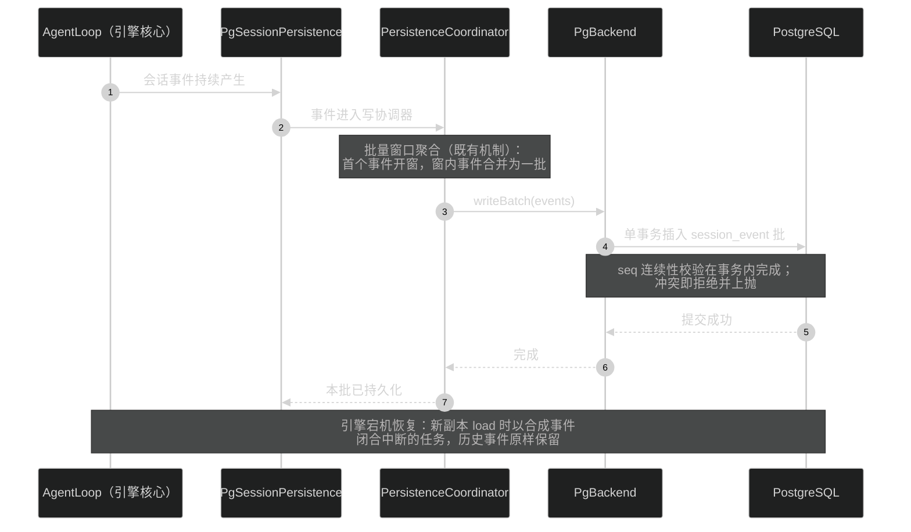

## 3.5 压测模拟器

外置工具，唯一使命是产出验收报告（M1~M5）。经 2.2 对外接口驱动，不走任何内部通道——压测流量与真实用户流量同构，结论才可外推。

### 3.5.1 对外提供的接口

无对外同步接口。驱动方式：读取压测计划（并发档位、行为分布、时长），执行后经 `stats()` 与引擎指标采集数据，输出对照报告。

### 3.5.2 内部结构

编排型模块，难点在"行为模型要像真人"。

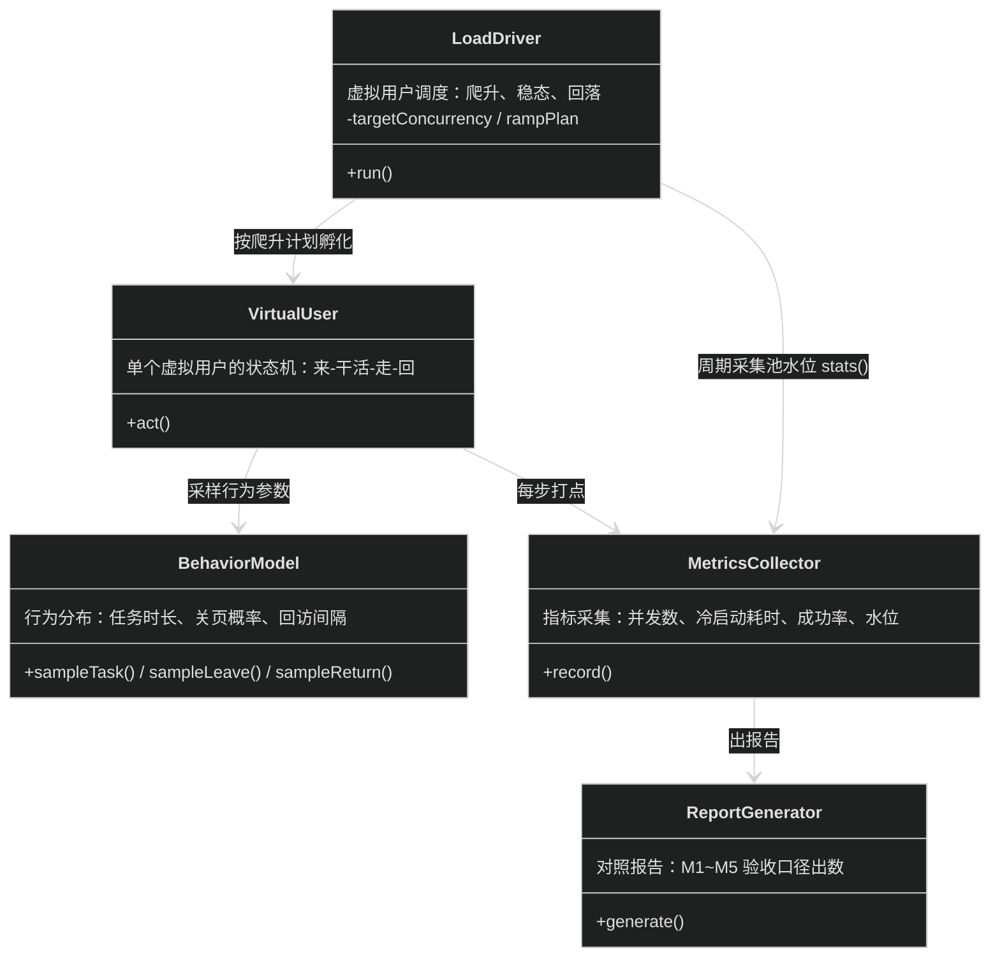

**并发模型**：事件驱动的虚拟用户协程，单进程可模拟数千并发用户；虚拟用户之间无共享状态，扩模拟器实例数即可加压倒目标规模。行为分布参数（任务 1~2 分钟为主、少量几十分钟长任务；回访间隔 <15 分钟高频）来自 D5 的估算口径，配置化可调。

### 3.5.3 内部协作时序

核心场景：**一轮 M1 容量压测**（爬升到稳态，记录拐点）。

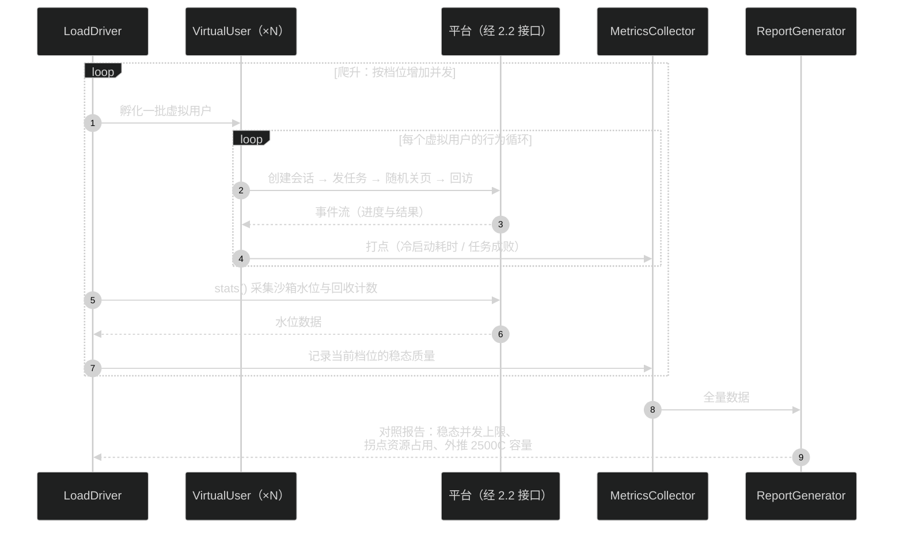

> M2（冷启动 p95）与 M3（关页续跑）为同一框架下的专项场景：分别固定"回访间隔 >15 分钟"与"发任务后立即断连"的行为参数，不再单独展开。
